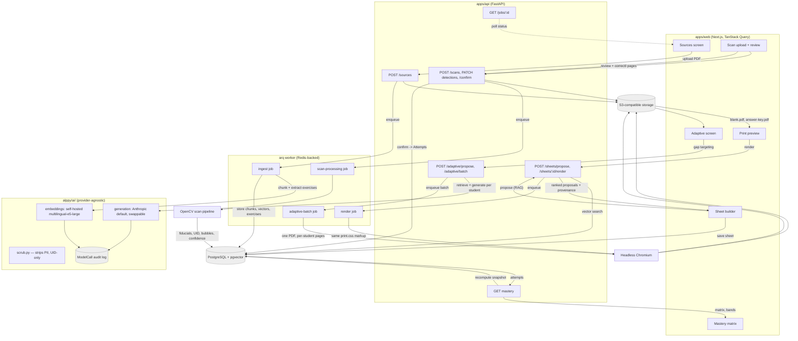

# Architecture

Alppy is a pnpm/Turborepo monorepo: a Next.js teacher-facing web app, a Python API, and a shared
worker for everything that must not block an HTTP request. This document describes the stack, the
four core data flows, the request/job lifecycle, and the tenancy model.

## 1. Stack

| Layer            | Choice                                                     | Notes                                                                                                                                                        |
| ---------------- | ---------------------------------------------------------- | ------------------------------------------------------------------------------------------------------------------------------------------------------------ |
| Monorepo         | pnpm workspaces + Turborepo                                | `apps/*`, `packages/*`; `turbo.json` wires `build`/`typecheck`/`test` task graphs                                                                            |
| Web              | `apps/web` — Next.js (App Router), TypeScript, Tailwind v4 | Server components for data-heavy screens, client components for interactive builders/review UIs                                                              |
| i18n             | `next-intl`                                                | fr default, de, en — locale is a teacher preference (`Teacher.locale`), not a route the school configures once                                               |
| Client data      | TanStack Query                                             | Consumes `packages/shared`, a client generated from the API's served OpenAPI schema — never hand-written against assumptions                                 |
| API              | `apps/api` — Python 3.12, FastAPI                          | Thin HTTP layer; business logic lives in `alppy/{sheets,mastery,ingest,scan,ai}`                                                                             |
| ORM / migrations | SQLAlchemy 2 (typed, `Mapped[...]`) + Alembic              | One migration per schema change, no autogenerate-and-forget                                                                                                  |
| Validation       | Pydantic v2                                                | Request/response schemas in `alppy/schemas`, separate from ORM models in `alppy/models`                                                                      |
| Background work  | `arq` (Redis-backed) worker                                | Ingestion, PDF rendering, scan processing, adaptive batch generation — anything slower than a request/response cycle                                         |
| Broker/cache     | Redis                                                      | `arq` queue + short-lived job status                                                                                                                         |
| Database         | PostgreSQL + `pgvector`                                    | One relational store for domain data and vector search — no separate vector DB                                                                               |
| Object storage   | S3-compatible (MinIO locally)                              | Source PDFs, rendered sheets/answer keys, scan images                                                                                                        |
| AI layer         | `alppy/ai/` — provider-agnostic                            | Anthropic default for generation; embeddings self-hosted (see ADR 0001); every model call is logged (`ModelCall`) and PII-scrubbed (see `docs/privacy.md`)   |
| Scan pipeline    | OpenCV                                                     | Fiducial detection, deskew, UID-grid read, bubble/mark detection                                                                                             |
| PDF rendering    | Headless Chromium over the app's own print markup          | The PDF a teacher downloads is a screenshot-to-PDF of the same `print.css`-styled HTML the print-preview screen renders — one layout implementation, not two |

## 2. Component and data-flow diagram



### Flow 1 — Ingestion

Teacher uploads a PDF (`POST /sources`) → file lands in S3-compatible storage → an `arq` job chunks
the document, calls the self-hosted embedding model (never a third-party vendor — see ADR 0001),
extracts candidate exercises, and writes `Source`, `SourceChunk` (with `vector(1024)`), and
`Exercise` rows. The request handler returns immediately with a job id; the Sources screen polls
`GET /sources/{id}/status`.

### Flow 2 — Sheet generation + PDF

The sheet builder calls `POST /sheets/propose` with class/subject/chapters/intent; the API runs a
`pgvector` similarity search plus ranking and returns exercises with provenance (source, page,
chunk). The teacher assembles a `Sheet`. Rendering (`POST /sheets/{id}/render`) is a job: headless
Chromium renders the **same** print-styled HTML the in-app preview uses, producing `blank.pdf` and
`answer-key.pdf` into S3-compatible storage. One layout implementation serves both the screen
preview and the PDF, so they cannot drift apart.

### Flow 3 — Scan → detection → grading

A scanned/photographed sheet is uploaded (`POST /scans`) → job runs OpenCV: fiducial-based
registration and deskew, UID-grid read (identifying the student without OCR of a name), and
bubble/mark detection with a confidence score per item. Results land as `ScanPage`/`Detection` rows
for teacher review; low-confidence detections are flagged for the review UI rather than
auto-accepted. `POST /scans/{id}/confirm` turns confirmed detections into `Attempt` rows and
triggers mastery recomputation — grading never happens purely automatically for anything below a
confidence threshold.

### Flow 4 — Mastery → adaptive generation

Confirmed `Attempt` rows feed the mastery recompute (`docs/mastery-model.md`): a weighted,
time-decayed accuracy score per (student, competency), banded into five levels. The adaptive screen
reads that matrix to target gaps, then `POST /adaptive/propose` mixes retrieved (RAG) and
AI-generated exercises per student, routed through `alppy/ai/` (PII-scrubbed, UID-addressed, logged
to `ModelCall`). Batch export (`POST /adaptive/batch`) is a job producing one PDF containing one
`.print-page` per physical page across the whole class.

## 3. Request/job lifecycle: nothing blocks a handler on a model call

A FastAPI request handler never awaits an LLM call, an embedding call, OpenCV processing, or
Chromium rendering directly. The rule is structural, not a convention to remember:

1. A handler that needs slow work does exactly one thing: validate the request, write/enqueue a
   job row, return a job id (or, for already-fast reads like a vector search used interactively in
   the sheet builder, run synchronously because it is genuinely sub-second — the line is "does this
   call an external model or a CPU-heavy pipeline", not "is this a POST").
2. The `arq` worker picks up the job, does the slow work (model call, CV pipeline, Chromium
   render), and writes its result to Postgres/S3.
3. The client polls `GET /jobs/{id}` (or a screen-specific status endpoint like
   `GET /sources/{id}/status`) until the job resolves, then fetches the result normally.

This keeps API pods stateless and cheap to scale independently of worker capacity, keeps a slow
provider or a stuck CV pipeline from exhausting the request-handling thread/connection pool, and
gives every slow operation a natural place to record progress, retries, and failure — a job row —
rather than a request that simply times out.

## 4. Tenancy model

Every table carries `school_id` (see `docs/plan.md` §3 for the full domain model), and
`teacher_id` additionally where a row has personal ownership (e.g. a `Source` a specific teacher
uploaded, even though it belongs to the school). Two consequences, both enforced structurally:

- **Every query is scoped.** Data-access functions in `alppy/` take the authenticated
  session's `school_id` as a required parameter (not an optional filter) and every generated SQL
  statement includes it — there is no "list all X" code path that omits the tenant scope, so a
  missing `WHERE school_id = ...` is a compile-time-visible gap in the function signature, not a
  runtime bug that only shows up when tested.
- **Cross-school access has no code path**, not just a permission check. A teacher's session is
  resolved to exactly one `school_id`; the object-fetching layer will not return a row belonging to
  a different school regardless of what id a client requests — this is the same mechanism that
  answers the "who can access" column in `docs/privacy.md`'s data inventory.

Multi-school deployments (a teacher who moves schools, a canton piloting across several schools)
are modelled as separate `School` rows with no implicit relationship between them; any
cross-school reporting is a deliberate, audited, opt-in feature, not a default query capability.

### The second layer: the database's own boundary (D84)

Both bullets above are the *application's* promise. Since D84 there is a second layer that does
not depend on the application keeping it: **row-level security** on every school-scoped table,
plus the two association tables' parents, keyed on `app.current_school_id` — a session variable
set per transaction by `alppy/db/tenancy.py` once `get_membership` has proved the cookie against
`teacher_school`, and never anywhere else.

- **Unset is blind, not omniscient.** The policy predicate is
  `school_id = nullif(current_setting('app.current_school_id', true), '')::uuid`. A session that
  never resolved a membership sees nothing, so a forgotten tenant now returns an empty list
  rather than another school's roster.
- **`WITH CHECK` mirrors `USING`.** Writing into another school is refused as firmly as reading
  out of one.
- **Three roles' worth of privilege in two.** The API and worker connect as `alppy_app` (DML
  only, no `BYPASSRLS`); Alembic and the three cross-school CLI commands connect as the schema
  owner, which policies do not apply to. Pointing both at one role turns the whole mechanism off
  while everything still looks correct, so a staging or production boot that does is refused
  (`Settings._refuse_unsafe_deployment`).
- **`school` is the deliberate exception.** A teacher may work at several (D74), so its policy
  admits the current school *or* any school this teacher belongs to — hence the second GUC,
  `app.current_teacher_id`. Without it, login and `POST /auth/school/{id}` stop answering.
- **The worker resolves its tenant through `alppy_job_school`**, a `SECURITY DEFINER` function
  that takes a job id and returns a school id and can say nothing else: the tenant is on the row
  the worker is not yet allowed to read.

None of this is visible to the unit suite, which runs on SQLite. `scripts/check-rls.py` is where
it is exercised, on a real Postgres, in its own CI job — for the same reason
`scripts/check-schema-drift.py` has one.

## 5. Authentication and the session

The pieces are spread across four files by design — `core/security.py` owns the primitives,
`api/v1/auth.py` the endpoints, `api/deps.py` the per-request check, `web/src/middleware.ts` the
routing convenience — so this section is the one place that describes them as a whole.

**Passwords.** Argon2id via `argon2-cffi`, at that library's defaults, which are the OWASP-recommended
parameters. `needs_rehash` is checked on every successful login and the hash upgraded in place, so
raising the parameters later is a config change rather than a migration. A login for an unknown
address still verifies against a throwaway hash before failing (`auth.py`), so response time does not
reveal whether an address exists — the enumeration oracle that would otherwise turn a teacher list
into a confirmed-user list.

**The session is a signed cookie, not a server-side record.** `issue_session` serialises
`{"t": teacher_id, "s": school_id}` with `itsdangerous` under `ALPPY_SECRET_KEY` and a fixed salt;
the cookie is `httpOnly`, `SameSite=Lax`, `Path=/`, `max_age = ALPPY_SESSION_MAX_AGE_S` (12 h), and
`Secure` whenever `ALPPY_ENV` is `staging` or `production`. There is no session table and therefore
no server-side revocation: rotating `ALPPY_SECRET_KEY` invalidates every session at once, and that
is the only lever. `ALPPY_SECRET_KEY` left at its development default is refused at startup
(`Settings._refuse_unsafe_deployment`) precisely because it is the whole of the authentication
system — anyone holding it can mint a valid cookie for any teacher in any school.

**The school in the cookie is a claim, and it is re-checked every request.** `get_membership`
(`api/deps.py`) reads the cookie, resolves the teacher, and then issues a `SELECT` against
`teacher_school` for the `(teacher_id, school_id)` pair — a query, deliberately, not
`session.school_id in teacher.schools`, which a stale identity map can answer. A teacher removed
from a school stops being able to act for it on their next request, not at their next login (D74).
`POST /auth/school/{id}` proves the membership once and re-issues the cookie naming the new school;
switching tenant is re-issuing that cookie, not a different kind of session.

**Cross-school failures read as 404, never 403.** A school the teacher does not work at is
_missing_, following the rule every ownership check here follows: a response must not confirm the
existence of something it will not open.

**Two documented bypasses, both off by default.** `ALPPY_DEMO_MODE` makes a cookieless request
resolve to `demo_teacher_email` instead of 401; `NEXT_PUBLIC_ALPPY_DEMO_MODE` stops the Next.js
middleware redirecting that visitor to `/login`. Both halves are needed for a working demo and
neither is dangerous alone (D62), and the API flag is refused outright in `staging`/`production`.
The middleware is a **routing convenience, not the security boundary** — the cookie is `httpOnly`,
so its mere presence is all the edge can check, and the API answers 401 on a forged or expired one
regardless of what the edge let through. Every authorisation decision in this product is made in
`api/deps.py`.

## 6. HTTP conventions the routers follow

These were followed consistently and written down nowhere, so the only way to learn them
was to read enough of `api/v1/` to notice (audit 02, L5–L7). None of this is new
behaviour; it is the existing behaviour, stated — and checked against the generated route
list rather than remembered.

### 6.1 How deep a path nests, and why it stops there

A **collection** hangs off at most one parent: `/classes/{id}/students`,
`/scans/{id}/detections`, `/sources/{id}/exercises`. The parent is the resource that
answers *"may I see this"* — ownership resolves from the class, the scan or the source —
so it is in the path, and everything narrower is a query parameter.

Paths go one level deeper only to name **a relationship, or an action on a member**, and
the last segment is then a noun for the relationship itself or a verb for a state change
that is not an edit:

```
POST   /classes/{id}/students/{id}/enrollment          the membership, as a thing
POST   /classes/{id}/teachers/{id}/branches/{id}       who teaches what, here
POST   /scans/{id}/detections/{id}/revert              undo, not a field edit
POST   /scans/{id}/pages/{id}/discard
POST   /sources/{id}/sections/{id}/extract
```

The test is whether the last segment could sensibly be a `PATCH` of a field on the member.
Where it could, it is one — correcting a reading is `PATCH .../detections/{id}`. Where it
could not, because it is a transition with its own rules and its own refusals, it gets a
verb.

### 6.2 201 everywhere a row appears, including a join row

Every `POST` that causes a row to exist answers **201**, and that deliberately includes the
join tables: seating a pupil in another class, and assigning a teacher to a branch, both
create a membership row and both answer 201 — the same as minting pupils from a pasted
roster.

They are also **idempotent**: repeating one returns 201 and the same list, having changed
nothing. That combination is intentional. The alternative — 200 on the repeat — would make
the client's handling depend on state it does not have, and 201 describes what the resource
looks like afterwards rather than how much work the server had to do to get there.

`PUT /classes/{id}/subjects` answers **200**, because it replaces a whole set rather than
adding to one, and the set existed before.

### 6.3 The product's nouns and the schema's nouns are not the same words

The teacher-facing vocabulary is French and deliberately not the table names. Both appear
in the code, and neither is wrong; what matters is knowing which one you are reading.

| product (UI, French) | schema / API |
|---|---|
| Discipline / Branche | `Subject` |
| Thème | `Chapter` |
| Compétence | `Competency` |
| Classe, Groupe, Série | `Class` |
| Fiche | `Sheet` |
| Pile (de copies) | `Scan` |
| Élève | `Student` (one year) / `Person` (across years) |

`Chapter` is the one that catches people: it is a **Thème** in the product, it *sits*
under one Competence (`primary_competency_id`) and *credits* many
(`chapter_competency`), and those two are not interchangeable — see
[`docs/curriculum.md`](curriculum.md) §3.1.
