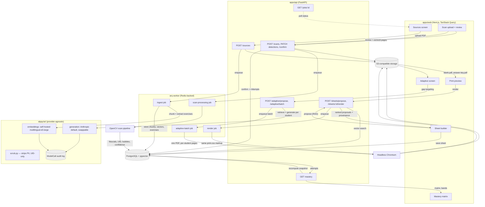

# Architecture

Alppy is a pnpm/Turborepo monorepo: a Next.js teacher-facing web app, a Python API, and a shared
worker for everything that must not block an HTTP request. This document describes the stack, the
four core data flows, the request/job lifecycle, and the tenancy model.

## 1. Stack

| Layer            | Choice                                                     | Notes                                                                                                                                                        |
| ---------------- | ---------------------------------------------------------- | ------------------------------------------------------------------------------------------------------------------------------------------------------------ |
| Monorepo         | pnpm workspaces + Turborepo                                | `apps/*`, `packages/*`; `turbo.json` wires `build`/`typecheck`/`test` task graphs                                                                            |
| Web              | `apps/web` — Next.js (App Router), TypeScript, Tailwind v4 | Server components for data-heavy screens, client components for interactive builders/review UIs                                                              |
| i18n             | `next-intl`                                                | fr default, de, en — locale is a teacher preference (`Teacher.locale`), not a route the school configures once                                               |
| Client data      | TanStack Query                                             | Consumes `packages/shared`, a client generated from the API's served OpenAPI schema — never hand-written against assumptions                                 |
| API              | `apps/api` — Python 3.12, FastAPI                          | Thin HTTP layer; business logic lives in `alppy/{sheets,mastery,ingest,scan,ai}`                                                                             |
| ORM / migrations | SQLAlchemy 2 (typed, `Mapped[...]`) + Alembic              | One migration per schema change, no autogenerate-and-forget                                                                                                  |
| Validation       | Pydantic v2                                                | Request/response schemas in `alppy/schemas`, separate from ORM models in `alppy/models`                                                                      |
| Background work  | `arq` (Redis-backed) worker                                | Ingestion, PDF rendering, scan processing, adaptive batch generation — anything slower than a request/response cycle                                         |
| Broker/cache     | Redis                                                      | `arq` queue + short-lived job status                                                                                                                         |
| Database         | PostgreSQL + `pgvector`                                    | One relational store for domain data and vector search — no separate vector DB                                                                               |
| Object storage   | S3-compatible (MinIO locally)                              | Source PDFs, rendered sheets/answer keys, scan images                                                                                                        |
| AI layer         | `alppy/ai/` — provider-agnostic                            | Anthropic default for generation; embeddings self-hosted (see ADR 0001); every model call is logged (`ModelCall`) and PII-scrubbed (see `docs/privacy.md`)   |
| Scan pipeline    | OpenCV                                                     | Fiducial detection, deskew, UID-grid read, bubble/mark detection                                                                                             |
| PDF rendering    | Headless Chromium over the app's own print markup          | The PDF a teacher downloads is a screenshot-to-PDF of the same `print.css`-styled HTML the print-preview screen renders — one layout implementation, not two |

## 2. Component and data-flow diagram

### Flow 1 — Ingestion

Teacher uploads a PDF (`POST /sources`) → file lands in S3-compatible storage → an `arq` job chunks
the document, calls the self-hosted embedding model (never a third-party vendor — see ADR 0001),
extracts candidate exercises, and writes `Source`, `SourceChunk` (with `vector(1024)`), and
`Exercise` rows. The request handler returns immediately with a job id; the Sources screen polls
`GET /sources/{id}/status`.

### Flow 2 — Sheet generation + PDF

The sheet builder calls `POST /sheets/propose` with class/subject/chapters/intent; the API runs a
`pgvector` similarity search plus ranking and returns exercises with provenance (source, page,
chunk). The teacher assembles a `Sheet`. Rendering (`POST /sheets/{id}/render`) is a job: headless
Chromium renders the **same** print-styled HTML the in-app preview uses, producing `blank.pdf` and
`answer-key.pdf` into S3-compatible storage. One layout implementation serves both the screen
preview and the PDF, so they cannot drift apart.

### Flow 3 — Scan → detection → grading

A scanned/photographed sheet is uploaded (`POST /scans`) → job runs OpenCV: fiducial-based
registration and deskew, UID-grid read (identifying the student without OCR of a name), and
bubble/mark detection with a confidence score per item. Results land as `ScanPage`/`Detection` rows
for teacher review; low-confidence detections are flagged for the review UI rather than
auto-accepted. `POST /scans/{id}/confirm` turns confirmed detections into `Attempt` rows and
triggers mastery recomputation — grading never happens purely automatically for anything below a
confidence threshold.

### Flow 4 — Mastery → adaptive generation

Confirmed `Attempt` rows feed the mastery recompute (`docs/mastery-model.md`): a weighted,
time-decayed accuracy score per (student, competency), banded into five levels. The adaptive screen
reads that matrix to target gaps, then `POST /adaptive/propose` mixes retrieved (RAG) and
AI-generated exercises per student, routed through `alppy/ai/` (PII-scrubbed, UID-addressed, logged
to `ModelCall`). Batch export (`POST /adaptive/batch`) is a job producing one PDF containing one
`.print-page` per physical page across the whole class.

## 3. Request/job lifecycle: nothing blocks a handler on a model call

A FastAPI request handler never awaits an LLM call, an embedding call, OpenCV processing, or
Chromium rendering directly. The rule is structural, not a convention to remember:

1. A handler that needs slow work does exactly one thing: validate the request, write/enqueue a
   job row, return a job id (or, for already-fast reads like a vector search used interactively in
   the sheet builder, run synchronously because it is genuinely sub-second — the line is "does this
   call an external model or a CPU-heavy pipeline", not "is this a POST").
2. The `arq` worker picks up the job, does the slow work (model call, CV pipeline, Chromium
   render), and writes its result to Postgres/S3.
3. The client polls `GET /jobs/{id}` (or a screen-specific status endpoint like
   `GET /sources/{id}/status`) until the job resolves, then fetches the result normally.

This keeps API pods stateless and cheap to scale independently of worker capacity, keeps a slow
provider or a stuck CV pipeline from exhausting the request-handling thread/connection pool, and
gives every slow operation a natural place to record progress, retries, and failure — a job row —
rather than a request that simply times out.

## 4. Tenancy model

Every table carries `school_id` (see `docs/plan.md` §3 for the full domain model), and
`teacher_id` additionally where a row has personal ownership (e.g. a `Source` a specific teacher
uploaded, even though it belongs to the school). Two consequences, both enforced structurally:

- **Every query is scoped.** Data-access functions in `alppy/` take the authenticated
  session's `school_id` as a required parameter (not an optional filter) and every generated SQL
  statement includes it — there is no "list all X" code path that omits the tenant scope, so a
  missing `WHERE school_id = ...` is a compile-time-visible gap in the function signature, not a
  runtime bug that only shows up when tested.
- **Cross-school access has no code path**, not just a permission check. A teacher's session is
  resolved to exactly one `school_id`; the object-fetching layer will not return a row belonging to
  a different school regardless of what id a client requests — this is the same mechanism that
  answers the "who can access" column in `docs/privacy.md`'s data inventory.

Multi-school deployments (a teacher who moves schools, a canton piloting across several schools)
are modelled as separate `School` rows with no implicit relationship between them; any
cross-school reporting is a deliberate, audited, opt-in feature, not a default query capability.
