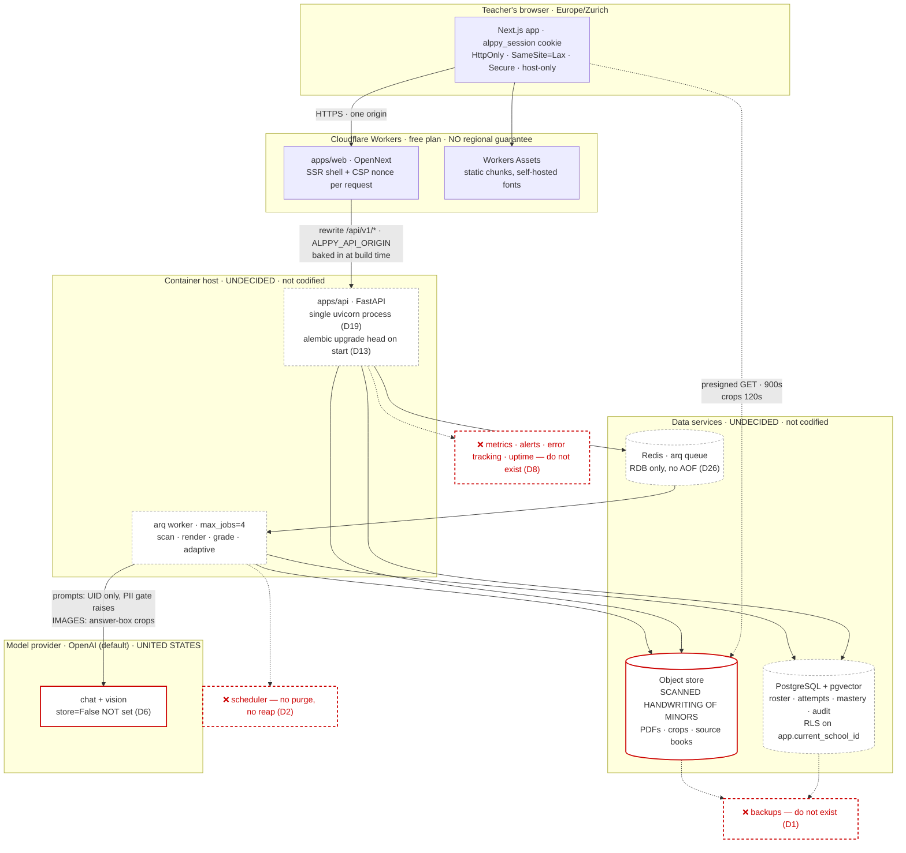

# Phase 7 — Deployment preparation audit

Read-only. Nothing was changed, provisioned or configured. Every claim below is
either grounded in `file:line` or states plainly that the thing does not exist.

Scope: what it takes to run Alppy outside a developer's machine, in front of real
Swiss *cycle 3* classes holding real minors' data. Carried forward from
[`01`](01-database-audit.md)–[`06`](06-integration-testing-audit.md).

Audited at `536490f` (`main`, clean tree), 2026-09-11.

---

## 1 · Verdict

**No. Not yet — and the gap is not in the application, it is in everything
around it.**

The application itself is in better shape for production than most code at this
stage. `core/config.py:_refuse_unsafe_deployment` is a genuinely good piece of
work: it refuses to boot a `staging` or `production` API on a development secret
key, a development S3 key, a local-filesystem storage backend, a wildcard or
localhost CORS list, demo mode, a localhost database, a staging bucket that
matches production's, or an `ALPPY_DATABASE_URL` that names the schema owner and
therefore switches row-level security off while looking healthy. Session cookies
gain `Secure` on the same test. The OpenAPI document is unmounted outside
development. The PII gate raises rather than redacting. Presigned crop URLs live
120 seconds. `gitleaks` over all 184 commits finds nothing, and the built client
bundle contains no secret. That is a real, defensible security posture at the
process boundary.

What is missing is the operational half, and it is missing almost entirely.
**There are no backups of anything, anywhere in this repository — no
configuration, no script, no documentation, no tested restore.** **There is no
scheduler**, so the four maintenance commands that enforce every retention window
(`purge-scan-images`, `purge-prompt-logs`, `purge-access-log`) and unblock every
stuck grading pile (`reap-jobs`) exist and are never run. **There is no defined
production infrastructure for the API half at all** — the only codified deploy
ships the Next.js Worker to Cloudflare; the API's host is a sentence in
`docs/deploy-cloudflare.md:43` ("Fly.io, Render or Railway will run the
container; budget roughly $5–10/month"), not a configuration. **There is no
staging environment**, which is what makes it true today that the print → scan →
grade loop has never been exercised on real paper at all
(`docs/handover.md` §6, M9). **There is no error tracking, no metrics, no
alerting and no uptime monitoring.** And **there is no data-protection
paperwork** — no DPA with either model vendor, no processing register, no DPIA,
no breach procedure, no privacy notice — a fact `docs/privacy.md` §6 states
itself, honestly and in full.

The single most consequential item: `ALPPY_SCAN_IMAGE_RETENTION_DAYS` defaults to
**0, meaning keep forever** (`core/config.py:321`), and nothing is scheduled to
purge even when it is set. Photographs of named children's handwriting therefore
accumulate without bound from the first pilot day. That is a liability that
grows daily and it is the one the code itself calls out.

---

## 2 · Go / no-go blockers

Must be resolved **before any real student data enters the system**. Everything
else in this report can be sequenced after a pilot starts; these cannot.

| # | Blocker | Why it blocks |
|---|---|---|
| **B-1** | No backups of the database or the object store. None configured, none documented, none tested. | A volume loss is total and permanent loss of a term's graded work. There is no RPO and no RTO because there is nothing to measure. |
| **B-2** | Nothing is ever deleted. `scan_image_retention_days = 0` (keep forever), and no scheduler runs any purge command. | An unbounded, growing store of minors' handwriting. nLPD proportionality and the school's own duty of care both fail on day one. |
| **B-3** | No data-protection paperwork exists: no DPA with OpenAI or Anthropic, no processing register, no DPIA, no breach procedure, no privacy notice. | `privacy.md` §6 lists these as prerequisites in its own words. A cantonal IT department stops the procurement here. |
| **B-4** | Handwriting crops of minors go to **OpenAI, United States**, by default, and the client never asks for zero retention (`ai/providers.py:338` calls `responses.create` without `store=False`). | A third-country transfer of plausibly special-category data about children, with vendor-side retention left at the default. |
| **B-5** | No production infrastructure for the API is defined or codified anywhere. | There is no deployment to make safe. Every step would be done by hand, by one person, from memory. |
| **B-6** | `docker compose up` — the one command the README leads with — publishes Postgres, Redis and the MinIO console to the host with development default credentials and no Redis password. | If compose is what reaches a VPS (and nothing else exists), the database holding the roster is on the public internet with password `alppy`. |
| **B-7** | No error tracking, no metrics, no alerting, no uptime monitoring, no on-call. | Failures cluster 08:00–17:00 Mon–Fri and a failure during a lesson is unrecoverable for that lesson. Today nobody would learn of one except from the teacher. |
| **B-8** | No runbook, and no way to create a teacher account other than `alppy.cli seed`. | Onboarding an establishment, resetting a teacher's access, or recovering a stuck batch each require manual database work by the one person who built it. |

---

## 3 · Findings table

Ordered by (blocking-for-launch, then severity, then irreversibility).

| ID | Sev | Area | Summary | Evidence |
|---|---|---|---|---|
| D1 | Critical | Continuity | No database backup of any kind — no configuration, script, schedule, or documentation | does not exist (`grep -rni "backup\|pg_dump\|pitr"` over `docs/ infra/ scripts/ .github/ apps/` returns only prose about textbook licensing) |
| D2 | Critical | Retention / nLPD | No scheduler exists; every retention window and the stale-job reaper are hand-run CLI commands | `cli.py:162,185,232,291`; no `cron_jobs` in `worker/main.py:49-70`; no cron in `docker-compose.yml` or `.github/workflows/` |
| D3 | Critical | nLPD | Scan images are kept forever by default and the purge refuses to run without a window | `core/config.py:321` (`scan_image_retention_days: int = 0`), `privacy.md:212-219` |
| D4 | Critical | Infrastructure | No production infrastructure definition for the API, worker, Postgres, Redis or object store; no IaC, no image registry, no API deploy pipeline | does not exist; `deploy-cloudflare.md:43` names hosts in prose only |
| D5 | Critical | Exposure | Compose publishes Postgres, Redis and the MinIO console on the host; Redis has no password; all three carry development default credentials | `docker-compose.yml:22,35,51-52,16-17,46-47,107` |
| D6 | Critical | Residency | Minors' handwriting crops transfer to OpenAI (US) by default with no `store=False` and no DPA | `privacy.md:118-134`, `ai/providers.py:314-352`, `core/config.py:169` |
| D7 | Critical | Legal readiness | No DPA, processing register, DPIA, breach procedure, subprocessor list, or privacy notice | `privacy.md:255-279` (states this itself) |
| D8 | Critical | Observability | No error tracking, metrics, alerting, uptime monitoring or log destination | does not exist (`grep -rni "sentry\|prometheus\|opentelemetry\|statsd"` → only Next.js internals) |
| D9 | Critical | Operations | No runbook: no deploy, rollback, restore, secret-rotation, worker-drain or stuck-batch procedure | does not exist |
| D10 | Critical | Continuity | Object storage has no backup, no versioning (explicitly disabled) and no deletion protection | `infra/minio/init-bucket.sh:24-27` |
| D11 | High | Environments | No staging environment exists; the code supports `ALPPY_ENV=staging` with real guards that nothing exercises | `core/config.py:397-441`; nothing deploys it |
| D12 | High | Onboarding | No account provisioning: no endpoint creates a teacher, resets a password, or revokes school access | `api/v1/auth.py:29-136` (five routes, none of them) |
| D13 | High | Migrations | Migrations run automatically on every API container start, with no advisory lock, no dry-run and no review gate | `infra/api/entrypoint.sh:16-24` |
| D14 | High | Migrations | Rolling deploys are unsafe: four migrations rename columns in place, so old and new app versions cannot share a schema | `0019:61`, `0021:82,168`, `0028:205` |
| D15 | High | Rollback | No tested rollback path, and several data migrations are irreversible in substance | `0041_anonymise_names.py:26-30` ("Not reversible in substance") |
| D16 | High | Build | The API image's dependency fallback has drifted from `pyproject.toml`: it omits `openai` (the *default* chat provider) and `pillow-heif` (the iPhone HEIC scan path), and `2>/dev/null` hides which branch ran | `apps/api/Dockerfile:31-39` vs `apps/api/pyproject.toml:6-41` |
| D17 | High | Build | Same shape in the web image: `pnpm install --frozen-lockfile \|\| pnpm install` defeats the lockfile on any failure | `apps/web/Dockerfile:17` |
| D18 | High | Build | Not reproducible: no Python lockfile, all API deps are `>=` ranges, and every base image is a floating tag (`minio/minio:latest` among them) | no lockfile in `apps/api/`; `Dockerfile:9`, `apps/web/Dockerfile:6,44`, `docker-compose.yml:13,30,43,62` |
| D19 | High | Capacity | One uvicorn process, no `--workers`, serving a whole establishment | `apps/api/Dockerfile:58`, `infra/api/entrypoint.sh:53` |
| D20 | High | Capacity | Open-answer grading is strictly sequential inside one 600 s job; a class set of written answers is cancelled mid-pile and then blocks confirmation until `reap-jobs` is run by hand | `services/open_answer_grading.py:409-419`, `worker/main.py:68`, `core/config.py:288-297` |
| D21 | High | Cost | No AI spend cap of any kind — per teacher, per school or global. `cost_estimate_chf` is written and never summed, capped or alerted on | `ai/client.py:161-180`, `models/__init__.py` `ModelCall`; no query aggregates it |
| D22 | High | Config drift | `WorkerSettings.job_timeout` and `max_jobs` are literals; `settings.job_timeout_s`'s own docstring claims `WorkerSettings` reads it | `worker/main.py:68-69` vs `core/config.py:279-287` |
| D23 | High | TLS | No `Strict-Transport-Security` header anywhere, on either app | `lib/csp.ts:115-128`, `main.py:45-49` |
| D24 | High | Secrets | The session signing key is a single value with no key ring; rotating it logs every teacher out mid-lesson | `core/security.py:59-71` |
| D25 | High | CI gating | CI never builds either container image; the only build is the nightly, non-gating `live.yml` | `.github/workflows/ci.yml` (no docker step), `live.yml:22-25` |
| D26 | High | Continuity | Redis holds the arq queue with `--save 60 1`; losing it loses in-flight jobs and leaves `Job` rows RUNNING until a hand-run reap | `docker-compose.yml:31`, `cli.py:232` |
| D27 | High | Config | `apps/web` has no config module: four runtime `process.env` reads with silent fallbacks and no startup validation | `middleware.ts:54,62,72`, `lib/csp.ts:60-61`, `lib/api/client.ts:39,59-60` |
| D28 | Medium | Deploy | No deploy window discipline; `deploy-web.yml` fires on every push to `main` | `.github/workflows/deploy-web.yml:9-12` |
| D29 | Medium | Availability | No maintenance mode; a teacher would meet the proxy's untranslated error page | does not exist |
| D30 | Medium | Scaling | Rate-limit and idempotency buckets are per-process in memory; horizontal scaling multiplies every ceiling | `api/deps.py:246,317-350`; documented at `core/config.py:215-216` |
| D31 | Medium | CI secrets | `golden-set.yml` exposes `ALPPY_ANTHROPIC_API_KEY` to any same-repo PR touching four paths, with no `environment:` gate | `.github/workflows/golden-set.yml:25-30,55-63` |
| D32 | Medium | Images | No container image vulnerability scanning; `pip-audit` and `pnpm audit` read the manifest, not the base image | `.github/workflows/ci.yml:102-131` |
| D33 | Medium | Logging | No log retention policy, no aggregation destination, and no test asserting logs carry no student data | `core/logging.py:29-47`; `main.py:73-79` logs `request.url.path`, which carries student UUIDs |
| D34 | Medium | Safety | `make down` is `docker compose down -v` — one word from `make up`, and it drops every volume | `Makefile:10-11` |
| D35 | Medium | Health | `/api/v1/health` is unauthenticated and reports database, Redis and storage reachability | `api/v1/health.py:74-91` |
| D36 | Medium | Export | Data portability is per-student only; `privacy.md` §4 promises a class-level export that does not exist | `api/v1/classes.py:394-411`, `privacy.md:194-197` |
| D37 | Low | Hygiene | A duplicated docs directory with a space in its name is committed | `docs/features/files (2)/` |
| D38 | Low | CDN | No CDN in front of the object store; crops are fetched from the bucket origin on every review row | `storage.py:243-261` |

**Verified as correct, recorded so nobody re-litigates them:** OpenAPI and Swagger
are unmounted in `staging`/`production` (`main.py:110-114`); the session cookie
gains `Secure` on the same test (`api/v1/auth.py:76,118`); `/health/live` does no
I/O so a Redis outage cannot restart-loop the API (`api/v1/health.py:55-71`);
`gitleaks git` over 184 commits finds nothing; the built client bundle contains no
`ALPPY_*` secret; `.dockerignore` and `.gitignore` both exclude `.env`; the
disposable-database guard means the two schema-dropping scripts cannot be pointed
at the application's own database.

---

## 4 · Detailed findings

### D1 · Critical — there are no backups, of anything

**Evidence:** does not exist. A sweep for `backup`, `pg_dump`, `restore`,
`point-in-time`, `pitr` across `docs/`, `infra/`, `scripts/`, `.github/` and
`apps/` returns only unrelated prose (textbook licensing, React focus
restoration). `docker-compose.yml:213-216` declares three named volumes and
nothing reads them.

**Production failure:** the Postgres volume is lost — a host failure, a
mis-typed `docker compose down -v`, a provider incident. Every attempt, every
mastery snapshot, every teacher correction, every roster is gone permanently.
There is no second copy. Because `make down` is `docker compose down -v`
(D34), the single most likely cause is a person typing `make down` meaning "stop
it".

**Fix:** managed Postgres with automated daily backups and point-in-time recovery
(Neon, Supabase, Exoscale DBaaS, Infomaniak — the choice is an open question,
§13); plus a documented, *executed* restore into a scratch database with the
measured wall-clock time written into the runbook. An untested backup is an
assumption, and this one has not even been assumed yet.

**Effort:** 1 day for managed-service backups, 1 day for the first real restore
drill and writing the number down.

---

### D2 · Critical — no scheduler exists, so nothing enforces anything

**Evidence:** the four maintenance commands all exist and are correct:

| Command | `cli.py` | What it enforces |
|---|---|---|
| `purge-scan-images --older-than-days N` | `:291` | `ALPPY_SCAN_IMAGE_RETENTION_DAYS` |
| `purge-prompt-logs` | `:162` | `ALPPY_AI_PROMPT_LOG_RETENTION_DAYS` (30) |
| `purge-access-log` | `:185` | `ALPPY_ACCESS_LOG_RETENTION_DAYS` (365) |
| `reap-jobs` | `:232` | `ALPPY_JOB_STALE_AFTER_S` — closes dead RUNNING rows |

Nothing runs any of them. `worker/main.py:49-70` declares `functions`,
`job_timeout`, `max_jobs` and `keep_result` — arq supports `cron_jobs` and none
is declared. `docker-compose.yml` has no scheduler service. No workflow in
`.github/workflows/` invokes the CLI. `cli.py:249` says `reap-jobs` is "safe to
run on a schedule beside `purge-prompt-logs`" — there is no schedule.

**Production failure, and it compounds with D20.** A teacher scans a class set
with written answers on Tuesday at 10:05. The grading job exceeds its 600 s
ceiling (D20) and arq cancels it; the partial commits survive but the remaining
detections stay PENDING, so `grading_in_progress` refuses confirmation
(`open_answer_grading.py:492-530` reasons about exactly this). The unblock is
`python -m alppy.cli reap-jobs`, which nothing runs. The pile is stuck until
someone with shell access notices — and the teacher's lesson was Tuesday.

Separately and permanently: `docs/privacy.md` presents a retention story to a
school that the deployment does not perform.

**Fix:** add `cron_jobs` to `WorkerSettings` — the worker is already a persistent
process with the right credentials — running `reap-jobs` every few minutes and
the three purges nightly. Prefer this to a platform scheduler: it is in the
repository, it is tested with the worker, and it cannot be forgotten when the
host changes.

**Effort:** half a day, plus a test that each cron entry is registered.

---

### D3 · Critical — scan images are kept forever by default

**Evidence:** `core/config.py:321` — `scan_image_retention_days: int = 0`, with a
docstring that is entirely honest about why: *"the number is a policy decision
about how long a contested grade can be appealed, not a technical one, and a
retention window guessed by a developer is worse than none"*. `privacy.md:212`
says it plainly: **"What actually happens today: nothing is deleted."**

This is the correct engineering decision and it is a **deliberate deferral, not
an omission** — the mechanism (`Storage.delete`, `purge-scan-images`,
`delete_student` removing a pupil's images, `person.anonymised_at` from
migration `0041`) is all built and all refuses to invent a policy. What is
missing is the decision, and the decision is the operator's (§13).

**Production failure:** an establishment of 280 pupils scanning two sheets a
month at ~1.5 MB per page grows the bucket by roughly 10 GB a school year, and
none of it ever leaves. The cost is trivial; the exposure is not. Every one of
those objects is a photograph of a named child's handwriting, and after three
years the answer to "how much of this do you hold and why" is "all of it, and
nobody chose".

**Fix:** set a number, then let D2's scheduler enforce it. The audit-suggested
default is a school year plus one term; §13 puts the choice to you with the
consequences.

**Effort:** the decision. The code is done.

---

### D4 · Critical — no production infrastructure is defined for the API half

**Evidence:** the entire infrastructure estate is three files —
`infra/postgres/init.sql` (roles and the pgvector extension, first-boot only),
`infra/minio/init-bucket.sh` (create a bucket) and `infra/api/entrypoint.sh`
(migrate, seed, serve). No Terraform, no Helm, no `fly.toml`, no
`render.yaml`, no Pulumi, no Ansible. `docs/deploy-cloudflare.md:43` is the
closest thing to a hosting decision and it reads: *"Fly.io, Render or Railway
will run the container; budget roughly $5–10/month."* D25 in the decisions log
records the split and its reason — correctly, and only for the web half.

There is also **no pipeline that builds or publishes the API image**.
`deploy-web.yml` ships the Worker; nothing ships the container.

**Production failure:** if the hosting account is lost, or the person who built
it is unavailable, the API, worker, database, Redis and bucket cannot be
rebuilt — not because it is hard, but because nothing anywhere records what was
done. Item 23 asks "what could not be rebuilt today": everything except the
Cloudflare Worker.

**Fix:** pick the host (§13), then codify it — even a `fly.toml` plus a
`docs/deploy-api.md` that a second person can follow is an enormous improvement
over prose. Add a workflow that builds `apps/api/Dockerfile` and pushes a tagged
image, so the deployed artefact has a name.

**Effort:** 2–4 days depending on the host.

---

### D5 · Critical — compose publishes every data service with default credentials

**Evidence:**

| Line | What it publishes | Default credential |
|---|---|---|
| `docker-compose.yml:22` | Postgres on `${POSTGRES_PORT:-5432}` | `alppy` / `alppy` (`:15-16`) |
| `:35` | Redis on `${REDIS_PORT:-6379}` | **none** — `:31` sets no `requirepass` |
| `:51-52` | MinIO API `:9000` **and console `:9001`** | `alppy` / `alppy-secret` (`:46-47`) |

`_refuse_unsafe_deployment` catches the *application's* defaults —
`ALPPY_S3_SECRET_KEY` at `alppy-secret` is refused outright in
`staging`/`production` (`core/config.py:406-410`). It cannot see the compose
file's port publication, and it does not inspect `ALPPY_REDIS_URL` for an absent
password at all.

**Production failure:** the README's first instruction is `docker compose up`
(`README.md:24-28`). The natural first deployment is that command on a VPS. The
result is a Postgres holding a roster of children's names answering on the public
internet with password `alppy`, a Redis with no authentication holding the job
queue, and a MinIO *console* offering a browsable bucket of scanned handwriting.
`ALPPY_ENV` would still be `local`, so none of the startup guards fire.

**Fix:** two changes, both cheap. (1) Bind the data-service ports to
`127.0.0.1` in compose — `"127.0.0.1:${POSTGRES_PORT:-5432}:5432"` — which costs
local development nothing and removes the class of accident entirely. (2) Extend
`_refuse_unsafe_deployment` to refuse a `staging`/`production` `redis_url` with
no password and a `postgres` DSN carrying a known development password, the same
way it already refuses `DEV_S3_SECRET_KEY`. (3) State in `README.md` and the
compose header that compose is a development and demo stack, not a deployment.

**Effort:** half a day.

---

### D6 · Critical — minors' handwriting goes to a US provider, with vendor retention left at the default

**Evidence:** `privacy.md:118-130` states the transfer with unusual clarity and
marks it as an open decision dated 2026-09-10. The default provider is OpenAI
(`core/config.py:169`, ADR 0002). What the audit adds is the *client
configuration*, which item 18 asks about specifically:

```
apps/api/alppy/ai/providers.py:314-319   OpenAI(api_key=…, timeout=…, max_retries=…)
apps/api/alppy/ai/providers.py:338-353   self._client.responses.create(model=…, instructions=…,
                                          input=…, max_output_tokens=…, temperature=…, timeout=…)
```

There is no `store=False`, no organisation-level zero-data-retention reference,
and no `metadata` marking the call. On the Responses API, `store` defaults to
enabled — so the request *and* the model's reading of a child's handwriting are
retained vendor-side by default. The Anthropic client (`:218-232`) has no
equivalent flag to set, and does not train on API inputs by its own terms, but
that is a vendor commitment nobody here has in a contract (D7).

**Production failure:** a cantonal data-protection officer asks "where is this
child's handwriting processed, where is it stored, for how long, and under what
agreement". Today the answers are: United States; OpenAI's default retention; no
agreement.

**Fix, in order.** (1) Pass `store=False` on the grading path — one line, and it
is the only one of these you control unilaterally. (2) Decide the provider
question (§13): `ALPPY_AI_CHAT_PROVIDER=echo` runs the product with grading
producing no attempt rather than a wrong one, and a regional or self-hosted
vision model substitutes without touching call sites — both exits already exist,
which is the design's real payoff. (3) Get the DPA (D7).

**Effort:** (1) an hour. (2) a decision. (3) weeks, and not engineering work.

**Note this is not a review of `privacy.md`'s honesty** — that document names
this risk itself, in the right words, before this audit did. The finding is that
the code has one configurable lever it is not pulling.

---

### D7 · Critical — no data-protection paperwork exists

**Evidence:** `privacy.md:255-279` enumerates it against itself: no DPIA, no
processor agreements with the school or with any subprocessor, no breach
notification process, no subprocessor register, no signed-off retention windows,
no parental notice or rights process. Nothing elsewhere in the repository
contradicts that list.

**Production failure:** this is the one that stops a procurement rather than
breaks a service. A cantonal school authority evaluating Alppy asks for the
processing register and the subprocessor list, and there is nothing to hand
over. Worse, `privacy.md:194-210` describes an export-and-deletion regime richer
than what is implemented (D36, D3), so a document written in good faith would
overstate the product if handed over today.

**Fix:** out of engineering scope, but §6 of this report gives the
present/partial/absent state in a form that can be taken to counsel, and §5 gives
the data-flow table a DPO will ask for first.

---

### D8 · Critical — nothing is watching anything

**Evidence:** no error tracker (`sentry`, `bugsnag`, `rollbar` — none present),
no metrics (`prometheus`, `statsd`, `opentelemetry` — only Next.js's own vendored
copies), no alerting, no uptime monitoring, no log aggregation destination.

The *inputs* are unusually good and go nowhere. `core/logging.py:29-47` emits
structured JSON with a request id bound to every line
(`main.py:60-84`), the id is accepted from the caller and validated against
`[A-Za-z0-9._-]{1,64}` so a newline cannot forge a log entry
(`main.py:32`), and there is a clean vocabulary of ~48 event names. All of it
goes to stdout and is read by nobody.

See §9 for the product-specific gaps (items 52–53), which are the more
interesting half.

---

### D9 · Critical — no runbook, and the bus factor is one

See §11 for the direct answer to item 67.

---

### D10 · Critical — object storage has no backup, no versioning, no deletion protection

**Evidence:** `infra/minio/init-bucket.sh:24-27` disables versioning
deliberately, on the reasoning that objects are addressed by content-derived
keys. That reasoning is partly right and the conclusion is wrong for production:
`storage.py:53-56` builds keys as `<kind>/<school_id>/<entity_id>/<leaf>` where
the leaf is a *sanitised client filename*, not a hash — so two uploads of
`IMG_0042.jpg` for the same entity collide. And versioning's real value here is
not collision, it is undoing a mistaken `purge-scan-images --older-than-days 1`.

**Production failure:** a database restore from D1's backups succeeds and points
at scan images and rendered PDFs that no longer exist. Item 35's exact shape: a
partial loss that looks like a full recovery, discovered by a teacher opening a
review screen of empty frames.

**Fix:** object versioning plus a lifecycle rule on whatever store is chosen
(R2 and most S3-compatibles support both), and bucket deletion protection. Then
make the restore drill (D1) restore *both* halves and check a crop opens.

---

### D11 · High — no staging environment

**Evidence:** `ALPPY_ENV` accepts `staging` (`core/config.py:59`) and the
startup validator has staging-specific logic that is genuinely thoughtful —
`production_s3_bucket` must be named on a staging deployment so an overlap with
production's bucket of children's handwriting can be refused
(`:429-440`), and `seed_teacher_password` is required because the demo
credentials are published in this repository (`:159-163`). Nothing deploys it.
`.github/workflows/deploy-web.yml:23` names `environment: production` and there
is no staging counterpart.

**Production failure:** item 1's consequence, and it is the load-bearing one for
this product. The print → scan → grade loop is physical. `docs/handover.md` §6
(M9) says it plainly: *"Nothing else matters until this is done. Run `docker
compose up` for the first time, render a sheet, print it on an actual printer,
have people fill it in with actual pencils, photograph it with actual phones."*
Without a staging analogue, that validation either happens in production, on a
real class, or not at all. The VLM grading path has the same problem: every test
drives a stub or the echo provider.

**Fix:** one staging deployment on the same host as production with its own
database, its own bucket (named in `ALPPY_PRODUCTION_S3_BUCKET` so the guard
fires), its own provider key, and a seeded synthetic roster. The guards are
already written for it.

---

### D12 · High — no way to create a teacher account

**Evidence:** `api/v1/auth.py` has exactly five routes — `login`,
`school/{id}`, `logout`, `me`, `teachers/me/preferences` (`:29,87,124,129,136`).
There is no create, no invite, no password reset, no password change, no
deactivate. A sweep for `create_teacher`, `password_reset`, `set_password` and
`invite` across the API and services layer returns nothing. The only path that
creates a teacher is `alppy.cli seed`. Audit 02 raised this as H7 and it is
unchanged.

**Production failure:** onboarding an establishment means someone running SQL
against production. A teacher who forgets their password means someone running
SQL against production. A teacher who leaves the school means someone running SQL
against production — and `POST /schools/{id}/teachers/{id}` grants school-wide
read with no revoke route (audit 02 H6), so the row has to be deleted by hand,
against tables whose whole design says memberships are intervals and leaving is
an `UPDATE` (D87). Manual SQL is exactly the operation that will get that wrong.

**Fix:** a minimal admin surface — invite, reset, revoke — before the first
establishment, not after the first support ticket.

---

### D13 · High — migrations run automatically, unlocked, on every container start

**Evidence:** `infra/api/entrypoint.sh:16-24` runs `alembic upgrade head` with up
to ten retries before serving. `apps/api/alembic/env.py` takes no advisory lock.

**Production failure:** two consequences. First, a schema change reaches
production the moment a container restarts — including an autoscale event or a
crash loop — with no human gate and no dry run. Second, two API instances
starting together both run `upgrade head` concurrently; Alembic's version table
gives no mutual exclusion, so the outcome ranges from a harmless duplicate error
to a partially applied chain. `0042_source_chunk_hnsw.py` is the sharpest case:
it commits its own transaction and opens a second AUTOCOMMIT connection, and its
docstring already reasons about what a failure below that point would leave
behind.

**Fix:** take a Postgres advisory lock around the upgrade in `env.py` (four
lines, and it fixes the race for every future migration), and move the upgrade
out of the serving container's start into an explicit deploy step.

---

### D14 · High — rolling deploys cannot work across four of these migrations

**Evidence:** column renames, which are the one operation that has no
old-and-new-coexist story:

```
0019_class_enrollment.py:61    student.class_id      -> home_class_id
0021_teaching_and_schools.py:82  class.teacher_id    -> head_teacher_id
0021_teaching_and_schools.py:168 teacher.school_id   -> home_school_id
0028_person_identity.py:205    <4 tables>.student_id -> person_id
```

**Production failure:** during any rolling release that crosses one of these, the
old instance issues `SELECT student.class_id` against a schema where the column
is `home_class_id` and every request it serves 500s. Because migrations run at
container start (D13), the new instance applies the rename *while the old one is
still serving traffic* — so the window is guaranteed, not merely possible.

These four are already applied, so they are history for an existing deployment
and the finding is forward-looking: the pattern is established and nothing in the
repository warns against it. **The fix is a convention, not a patch** — the
expand/contract discipline (add the new column, dual-write, backfill, switch
reads, drop in a later release) written into `CLAUDE.md` beside the partial-index
rule, which is where rules that lint cannot catch live in this repository.

---

### D15 · High — rollback is undefined and partly impossible

**Evidence:** no rollback procedure exists in any document.
`deploy-web.yml` has no revert path (Cloudflare keeps prior Worker versions, but
nothing here says so or says how). On the database side,
`0041_anonymise_names.py:26-30` states that its `downgrade()` *"cannot restore a
name that was nulled — it will fail against any row that has been anonymised,
which is correct."* That is the right design and it means "roll back the
release" is not a single operation.

**Production failure:** a bad release at 09:30 on a Tuesday, and the recovery
procedure is invented under pressure by the one person who knows the system.

**Fix:** decide and document the strategy (recommended: forward-only for the
database, image-tag rollback for the application, with the constraint that a
release containing a destructive migration is not rollable and must say so in its
own commit message). Then *test it once* and write down what it took. An untested
rollback is not a rollback.

---

### D16 · High — the API image's dependency fallback has drifted from `pyproject.toml`

**Evidence:** `apps/api/Dockerfile:30-39`:

```dockerfile
RUN python -m pip install --upgrade pip \
    && pip install --no-cache-dir -e . 2>/dev/null || pip install --no-cache-dir \
        "fastapi>=0.115.0" … "anthropic>=0.40.0" … "email-validator>=2.2.0"
```

Diffing that hardcoded list against `apps/api/pyproject.toml:6-41`, the fallback
is missing **`openai>=1.60.0`** and **`pillow-heif>=0.21.0`**.

**Production failure:** if `pip install -e .` fails for any reason — and it is
run against a `/app` containing only `pyproject.toml`, with the package source
copied in eight lines later — the image is built from a stale list and two
things break in ways that look like product bugs rather than build bugs. Without
`openai`, the *default* chat provider's lazy import fails and the AI layer falls
back to `echo` (`privacy.md:135-138` describes exactly this symptom: "a
deployment holding the other provider's key is silently offline, and everything
it generates is derived from a hash"). Without `pillow-heif`, the upload
allowlist still accepts `image/heic` (`core/config.py:363-367`) and the decode
fails later — on an iPhone photograph of a class set, which is the primary
workflow, not a fallback.

And `2>/dev/null` means the build log cannot tell you which branch ran.

**Fix:** delete the fallback. `pip install -e .` either works or the build should
fail loudly. If the fallback exists because the editable install is unreliable
with no package directory present, reorder the COPY instead.

**Effort:** 15 minutes.

---

### D17 · High — the web image defeats its own lockfile

**Evidence:** `apps/web/Dockerfile:17` — `RUN pnpm install --frozen-lockfile ||
pnpm install`.

**Production failure:** the `|| pnpm install` branch resolves fresh versions
inside the image. A lockfile that is bypassed on failure is not a lockfile; the
deployed bundle can differ from every version that passed CI, silently.

**Fix:** remove the fallback. `pnpm-lock.yaml` is committed and CI already uses
`--frozen-lockfile` everywhere else.

---

### D18 · High — the build is not reproducible

**Evidence:**

- No Python lockfile anywhere. `apps/api/pyproject.toml:6-41` pins with `>=`
  only, so two builds a week apart install different SQLAlchemy, different
  OpenCV, different `anthropic`.
- Base images are floating tags: `python:3.12-slim` (`apps/api/Dockerfile:9`),
  `node:22-alpine` (`apps/web/Dockerfile:6,44`), `pgvector/pgvector:pg16`,
  `redis:7-alpine`, and **`minio/minio:latest`** (`docker-compose.yml:13,30,43`).
  None is pinned by digest.
- `dependabot.yml` is well-reasoned and covers pip, npm and actions — but it
  updates manifests, and the API manifest has no floor to move.

**Production failure:** "it worked yesterday" becomes unfalsifiable. A scan
detector is numerical code; an OpenCV or NumPy minor bump that changes a
threshold behaviour is exactly the class of change the degradation suite was
built to catch, and it would arrive unannounced in a rebuild nobody associates
with a dependency change.

**Fix:** adopt a Python lockfile (`uv lock` or `pip-compile` producing a hashed
`requirements.lock`, installed with `--require-hashes`), and pin base images by
digest with Dependabot keeping the digests fresh.

**Effort:** 1 day.

---

### D19 · High — one uvicorn process serves the whole establishment

**Evidence:** `apps/api/Dockerfile:58` and `infra/api/entrypoint.sh:53` both
`exec uvicorn alppy.main:app --host 0.0.0.0 --port 8000` — no `--workers`, so a
single process. `core/config.py:104` sets `db_pool_size: int = 10` with a
docstring reasoning about *the worker's* four concurrent jobs.

**Production failure:** usage is bursty and synchronised (item 60) — a break
between lessons is 60 teachers opening a matrix at once, and Argon2id on the
login path is deliberately expensive (`core/config.py:230-235` reasons about
this as a DoS surface). A single Python process with a GIL, serving synchronous
SQLAlchemy handlers, is the wrong shape for that spike.

There is a secondary, subtler effect: `core/config.py:215-216` and
`api/deps.py:414-455` document that the AI and render rate limits are *per
process*, so the effective ceiling is `limit × worker count`. Today that count is
1, which makes the limits tighter than the documentation assumes — and the
moment `--workers 4` is added, every ceiling quadruples silently.

**Fix:** set `--workers` deliberately against the chosen host's CPU allocation,
and at the same time move the rate-limit buckets to Redis (D30) so the ceiling
stops being a function of the process count.

---

### D20 · High — a class set of written answers cannot finish inside the job timeout

**Evidence:** the arithmetic is all in the repository.

```
services/open_answer_grading.py:409   for index, (detection, exercise) in enumerate(pending):
                                          grade_one(…)      # one provider call, sequential
worker/main.py:68                     job_timeout = 600     # seconds
core/config.py:307                    provider_timeout_s: float = 60.0
core/config.py:314                    provider_max_retries: int = 1
```

One provider call per crop, strictly sequential, inside one job with a 600 s
ceiling. A 24-pupil class with three written answers per sheet is 72 calls. At a
plausible 4–8 s per vision call that is 290–580 s, and the ceiling is 600. With
one slow call at the 60 s timeout plus its retry, the budget is gone.

The loop is otherwise carefully built — `db.commit()` after each answer so *"a
crash on answer 40 keeps the first 39"* (`:419`), and a final sweep settling
anything unreached (`:424-428`). But that sweep never runs when arq cancels the
job.

**Production failure:** the pile is left with PENDING detections, so
`grading_in_progress` refuses confirmation (`:492-511`), and the unblock is
`reap-jobs` — which nothing schedules (D2). Item 62 asks whether a 30-page batch
completes within a break; on the written-answer path the honest answer is that a
full class may not complete at all.

**Fix:** two changes, both small. Bound concurrency rather than running
sequentially (a small `asyncio.Semaphore` or thread pool over `grade_one`, sized
against the provider's rate limit) — this is where the wall-clock is. And chunk
the job so a class set is several jobs rather than one, so the timeout bounds a
chunk rather than the pile. Then schedule `reap-jobs` (D2) so the failure mode
that remains self-heals.

---

### D21 · High — model spend is entirely unbounded

**Evidence:** the accounting exists and nothing consumes it.
`ai/client.py:161-180` computes `estimate_cost_chf` from a list-price table and
logs `ai.cost.unknown_model` when the model is not in it; every call writes a
`ModelCall` row carrying `cost_estimate_chf`, `school_id` and `caller`
(`ai/audit.py:60`, `privacy.md:148-167`). No query sums it. No setting caps it.
No alert fires.

What *does* exist is a throttle, not a budget: `ai_rate_limit_per_min = 20` per
teacher **per process** (`core/config.py:215`), and per-call token ceilings
(`ai_max_output_tokens = 2048`, batch 8192).

**Production failure:** rate limits bound the *rate*, not the *total*. A term of
ingestion over a few real textbooks (`ingest/pipeline.py:621` budgets 200 chunks
per import, and a chapter extracts on first open thereafter, D27) plus daily
vision grading is an open-ended monthly bill on a school budget, with the first
signal being an invoice. Audit 02 H3 already found `/adaptive/feedback/generate`
queueing one provider call per student with no AI rate limit.

**Fix:** a daily and monthly cap per school read from `ModelCall`, checked in
`AiClient.complete` before the call and surfaced as a refusal a teacher
understands, plus a warning threshold logged at 80 %. The table it needs is
already written on every call — this is a query and a guard, not a new
subsystem.

---

### D22 · High — the worker ignores its own timeout settings

**Evidence:**

```
worker/main.py:68-69    job_timeout = 600   # literal
                        max_jobs = 4        # literal
core/config.py:279-287  job_timeout_s: int = 600
                        """Read by ``WorkerSettings`` and, just as importantly, by …"""
```

The docstring says `WorkerSettings` reads it. `WorkerSettings` does not.

**Production failure:** an operator raising `ALPPY_JOB_TIMEOUT_S` to fix D20
changes `job_stale_after_s`'s comparison basis and nothing else — jobs are still
cancelled at 600 s, and the reaper's window is now wrong relative to the real
timeout. The setting appears to work and does not.

**Fix:** read both from settings in `WorkerSettings`. `max_jobs` should be a
setting too (item 61: worker sizing should be deliberate).

---

### D23 · High — no HSTS

**Evidence:** `lib/csp.ts:115-128` defines four static security headers —
`X-Content-Type-Options`, `X-Frame-Options`, `Referrer-Policy`,
`Permissions-Policy` — and no `Strict-Transport-Security`.
`main.py:45-49` sets three on the API side and likewise none. A repository-wide
sweep for `strict-transport` finds nothing.

The rest of the posture is strong: the CSP is nonce-based with a hashed theme
script, `object-src 'none'`, `base-uri 'none'`, `frame-ancestors 'none'`,
`upgrade-insecure-requests` outside dev, and `'unsafe-eval'` admitted only in
dev (`lib/csp.ts:63-97`). The CSP is **enforced, not report-only**, on both
apps — item 42 answered.

**Production failure:** a teacher on a school or café network types
`alppy.ch`, the first request goes over HTTP, and the session cookie's `Secure`
flag protects the cookie but not the redirect. HSTS is what closes that, and
`upgrade-insecure-requests` does not substitute (it governs subresources of a
page already loaded over HTTPS).

**Fix:** add `Strict-Transport-Security: max-age=31536000; includeSubDomains` to
`STATIC_SECURITY_HEADERS`, guarded so it is not emitted in local development
over HTTP. Consider `preload` only after the domain is settled.

---

### D24 · High — the session key cannot be rotated without logging everyone out

**Evidence:** `core/security.py:59-71` builds a single
`URLSafeTimedSerializer(s.secret_key, salt=SESSION_SALT,
signer_kwargs={"digest_method": hashlib.sha256})`. One key, no fallback list.
`itsdangerous` supports a key ring — the newest key signs, any key verifies —
and it is not used.

**Production failure:** item 11's exact question. Rotating `ALPPY_SECRET_KEY`
invalidates every live session instantly. `session_max_age_s` is 12 hours, which
spans a school day, so a rotation at any working hour ejects every teacher
mid-lesson. That makes rotation a thing nobody does, which makes a suspected
compromise a much worse decision than it needs to be.

**Fix:** accept `ALPPY_SECRET_KEY` plus an `ALPPY_SECRET_KEY_FALLBACKS` list and
pass it to `URLSafeTimedSerializer`'s `fallback_signers`. Rotation then becomes:
add the new key as primary with the old one as fallback, deploy, wait 12 hours,
drop the old one. Three lines, and it turns an outage into a procedure.

---

### D25 · High — CI never builds the container images

**Evidence:** `.github/workflows/ci.yml` has twelve jobs and none of them runs
`docker build`. The images are built only by `live.yml:43-46`, which is nightly
and on-demand, and whose own header says it is deliberately not a merge gate.

**What CI *does* gate** (item 26), and it is a lot: ruff, mypy strict with the
config explicitly named, pytest with `--cov-fail-under=85` plus per-module floors
(`check-coverage-floors.py`), `pip-audit --strict`, `pnpm audit --audit-level
high`, gitleaks over full history, turbo lint/typecheck/build/test, stylelint and
a grep for colour literals in TSX, token completeness, i18n sync, the screen
inventory, the print-geometry round trip, the embedded-fonts diff, the generated
API contract diff, **schema drift against a real Postgres**, **row-level security
against a real Postgres**, and behavioural Playwright. That is a stronger gate
than most production systems have.

Two things are advisory rather than blocking, both honestly labelled in the
workflow files: the 42 screenshot tests are not run in CI at all (`ci.yml:413-428`
explains why — the baselines are macOS-only, and reporting 42 passing tests that
compared against nothing was judged worse than not claiming to check), and
`live.yml` is nightly.

**Production failure:** a Dockerfile change merges green and is discovered broken
at deploy time — or, worse, discovered *not* broken but subtly different (D16).
The deployed artefact is the one artefact CI does not produce.

**Fix:** add a `docker build` of both images to `ci.yml`. It need not push.

---

### D26 · High — Redis is a single point of failure with no recovery story

**Evidence:** `docker-compose.yml:31` runs `redis-server --save 60 1` — one
RDB snapshot if at least one key changed in 60 seconds, no AOF. Redis holds the
arq queue and short-lived job status; durable `Job` rows live in Postgres
(`worker/main.py:70`).

**Production failure:** Redis restarts and loses up to 60 seconds of queue. The
enqueued work is gone; the `Job` rows say RUNNING forever, because the reaper is
hand-run (D2). A teacher's scan sits at "processing" indefinitely with no error
anywhere.

**Fix:** enable AOF (`appendonly yes`) on whatever Redis is used in production,
and — more importantly — schedule `reap-jobs` so a lost job becomes a visible
failure within minutes rather than an eternal spinner.

---

### D27 · High — the web app has no configuration module

**Evidence:** every runtime `process.env` read in `apps/web`, excluding tests and
`playwright.config.ts`:

| Location | Variable | Fallback |
|---|---|---|
| `middleware.ts:54` | `NODE_ENV` | — (drives CSP `'unsafe-eval'`) |
| `middleware.ts:62` | `NEXT_PUBLIC_ALPPY_MOCK` | off unless `'1'` |
| `middleware.ts:72` | `NEXT_PUBLIC_ALPPY_DEMO_MODE` | off unless `'1'` |
| `lib/csp.ts:60` | `NEXT_PUBLIC_API_BASE_URL` | `null` → origin omitted from CSP |
| `lib/csp.ts:61` | `ALPPY_MEDIA_ORIGINS` | `[]` → same-origin images only |
| `lib/api/client.ts:39` | `NEXT_PUBLIC_API_BASE_URL` | `'/api/v1'` |
| `lib/api/client.ts:59-60` | `NEXT_PUBLIC_ALPPY_MOCK`, `NODE_ENV` | mock off in production |

**This is the answer to item 76 for the frontend, and item 4 as well.** On the
Python side, item 76 is *closed*: the only `os.environ` reads outside
`core/config.py` are in the two disposable-database scripts, and
`storage.py:281` and `sheets/render.py:266` carry comments recording that they
were moved into `Settings` precisely so `_refuse_unsafe_deployment` could see
them (audit 03, B25). The web app never got the same treatment.

**Production failure:** the compose file documents the exact accident at
`:200-206` — `ALPPY_MEDIA_ORIGINS` out of step with `ALPPY_S3_PUBLIC_ENDPOINT_URL`
means the scan review screen shows empty frames *"with the only explanation in
the browser console"*. Nothing validates the pair at startup, so a deployment
gets it by saying nothing — the same hazard `_refuse_unsafe_deployment` exists to
kill on the API side.

There is also a behaviour hidden behind `NODE_ENV` (item 4): `client.ts:60`
disables mock mode in production and `middleware.ts:54` drops `'unsafe-eval'`
from the CSP. Both are correct and neither is expressed as configuration.

**Fix:** one `src/lib/config.ts` that reads every variable once, validates the
combinations that must agree, and throws at module load. The API's module is the
model to copy.

---

### Medium findings, in brief

**D28 · No deploy window.** `deploy-web.yml:9-12` fires on every push to `main`
and on demand. Item 31's question — could a deploy land at 10:00 on a Tuesday
mid-lesson — has the answer yes, and for the Worker it already can. The intended
window is undecided (§13); the mechanism to enforce it is a `workflow_dispatch`-only
trigger plus a scheduled promotion, or a required review on the `production`
environment (which the workflow already declares at `:23` and which may or may not
have reviewers configured — not verifiable from the repository, §14).

**D29 · No maintenance mode.** Nothing in `apps/web` or the API serves a planned-
downtime page. A teacher meets the host's default error page, in English, during
any window where the API is down and the Worker is up. The app *does* now have
`error.tsx`, `global-error.tsx` and two `not-found.tsx` (audit 04 F6 closed), so
the shell for an intelligible French page exists — what is missing is a way to
turn it on deliberately.

**D30 · In-memory rate limiting.** `api/deps.py:246-350` keeps every token bucket
in process memory, including the login and per-IP buckets. Correct and documented
for one process; multiplied by every instance added. The login bucket is the one
that matters — `core/config.py:220-242` reasons carefully about credential
stuffing and Argon2id cost, and that reasoning assumes a shared bucket. Move them
to Redis before scaling out. (Note `trusted_proxy_hops` defaults to 0, which is
the safe default and **must** be set to the real hop count once a proxy is in
front, or every request appears to come from the proxy and the per-IP bucket
collapses to one shared bucket for the whole school — `core/config.py:245-258`
says exactly this.)

**D31 · CI secret exposure surface.** `golden-set.yml:25-30` triggers on
`pull_request` for four paths and `:61` passes `ALPPY_ANTHROPIC_API_KEY`. A fork
PR gets no secret (GitHub withholds them, and `:46-53` handles that case
explicitly and correctly by refusing to report a meaningless pass). A same-repo
branch PR *does* get the key, with no `environment:` gate and no reviewer
requirement. That is a smaller exposure than a fork, but it is the only workflow
where a code change and a live provider key meet.

**D32 · No image scanning.** `ci.yml:102-131` runs `pip-audit --strict` and
`pnpm audit --audit-level high` — both good, both manifest-level. Nothing scans
the `python:3.12-slim` or `node:22-alpine` layers, where the OS CVEs live. Add
Trivy or Grype to the `docker build` job D25 asks for. Item 48's policy half —
what happens when a finding appears — is also unwritten.

**D33 · Logs go nowhere and nothing asserts what they contain.** `main.py:73-79`
logs `path=request.url.path` on every request; student routes carry a student
UUID in the path (`/classes/…/students/<uuid>/…`), so the access log is a record
of who read which pupil — which is *intended* on the `AccessLog` table but is
also incidentally in stdout with no retention policy. No test asserts that no log
line carries `first_name`. Item 51's error-tracker half is moot only because
there is no error tracker; when one is added, its request-body and
session-replay settings are the first thing to disable — a scan review screen's
request bodies contain crop URLs and transcriptions.

**D34 · `make down` drops every volume.** `Makefile:10-11` —
`docker compose down -v`. One word from `make up`, in a repository with no
backups (D1). Rename it `make nuke` or drop the `-v`.

**D35 · `/api/v1/health` is unauthenticated.** `api/v1/health.py:74-91` reports
database, Redis and storage reachability to anyone. Low-value information
disclosure, and the right fix is not to authenticate it (a load balancer needs
it) but to have it return a bare `ok`/`degraded` publicly and the component
breakdown only on an internal port. `/health/live` is correct as it stands and
its docstring explains a real incident class worth keeping.

**D36 · Export is per-student only.** `api/v1/classes.py:394-411` serves
`GET /students/{id}/export`. `privacy.md:194-197` promises a *class* export of
"roster, sheets, scans, attempts, mastery snapshots, in a documented
machine-readable format (JSON + the original PDF/image assets)" as the mechanism
a school uses to take its data with it. That does not exist. Item 20's second
half — does deletion survive backups — is unanswerable today because there are
no backups; when there are, a deleted pupil must not be resurrectable by a
restore, which means the retention window on backups is itself a policy decision
(§13).

---

## 5 · Data residency and processor table

**For a cantonal IT department.** Every row marked *undecided* is a decision that
has not been taken, not an omission in this table. Nothing here is legal advice;
adequacy and transfer-mechanism columns require confirmation from counsel
(item 16).

### 5.1 · Processors and where data would live

| # | Service | Role | Data touched | Country of processing | Country at rest | Status |
|---|---|---|---|---|---|---|
| 1 | Cloudflare Workers | Web app (UI shell) + reverse proxy for `/api/v1/*` | Every API request and response **transits** here; no storage | Global anycast — **no regional guarantee on the free plan** | none (transit only) | **Deployed.** `deploy-cloudflare.md:150-154` flags this as the thing that changes if CH residency is required |
| 2 | API + arq worker container | All application logic | Everything | **Undecided** (`deploy-cloudflare.md:43` names Fly.io / Render / Railway as candidates) | n/a | **Not deployed** |
| 3 | PostgreSQL + pgvector | Roster, attempts, mastery, detections, audit | Names, UIDs, grades, teacher accounts | **Undecided** | **Undecided** | **Not deployed** |
| 4 | Object storage (S3-compatible; R2 suggested) | **Scanned pages, answer-box crops, rendered PDFs, source PDFs** | **Photographs of minors' handwriting** | **Undecided** | **Undecided** | **Not deployed** |
| 5 | Redis | Job queue, transient job status | UIDs and job metadata; no names | **Undecided** | ephemeral | **Not deployed** |
| 6 | OpenAI (default) | Generation **and vision grading** | Prompts (UID, never a name) **and answer-box crops** | **United States** | **Vendor default retention — `store=False` is not set** (D6) | **Default in code**, `core/config.py:169` |
| 7 | Anthropic (selectable) | Same | Same | United States | Vendor terms; no DPA | Selectable |
| 8 | Offline providers (`echo`/`hash`) | Same, deterministically | Nothing leaves | n/a | n/a | **The default in compose**, and a complete stand-in |
| 9 | Backups | — | — | — | — | **Do not exist** (D1) |
| 10 | CDN | — | — | — | — | Does not exist (D38) |
| 11 | E-mail | — | — | — | — | Does not exist — no password reset, no notifications (D12) |
| 12 | Error tracking | — | — | — | — | **Does not exist** (D8) |
| 13 | Analytics | — | — | — | — | Does not exist. Nothing tracks teachers. |
| 14 | Log aggregation | — | — | — | — | **Does not exist**; logs are JSON on stdout (D33) |
| 15 | GitHub Actions | CI, and the nightly golden set | Repository; **a real provider key on the golden-set job** | United States | n/a | Deployed |

### 5.2 · Item 15 — where minors' handwriting is, specifically

This is the most sensitive artefact in the system and it has four locations:

1. **In the object store, at rest, forever.** `Scan`/`ScanPage` page images and
   `Detection.crop_key` answer-box crops. `privacy.md:236-237` marks both
   "Kept indefinitely today". Region undecided (row 4); retention zero-enforced
   (D2, D3); no versioning, no backup, no deletion protection (D10).
2. **In transit to the model provider, on every written answer.** The crop is
   sent to whatever `ALPPY_AI_CHAT_PROVIDER` names — OpenAI, US, by default.
3. **At rest on the provider's side**, because `store=False` is not passed
   (D6).
4. **Not in `ModelCall`.** The audit row hashes the image into the prompt hash
   and stores neither image nor text (`privacy.md:99-100,162-167`). `PromptLog`
   can hold prompt *text* when explicitly enabled, is off by default, capped,
   swept, school-scoped, and written only after the PII gate passed. This part is
   right.

**What keeps a name out of the crop is geometry, not inspection**, and that is
correctly built: `measure_answer_boxes` refuses a box outside
`ITEMS_TOP_MM..ITEMS_BOTTOM_MM`, the printed sheet carries only a UID and no
name, and the crop is cut at the rectangle the renderer *measured* for that copy
rather than one recomputed later. The residual risk — a pupil writing their own
name inside the box — is documented rather than hidden (`privacy.md:96-98`).

### 5.3 · Transfers outside Switzerland

**Requires confirmation from counsel. Reported as the current position, not as a
legal conclusion.**

| Transfer | Destination | Current safeguard |
|---|---|---|
| Every API request via the Worker | Cloudflare, no regional guarantee | None specific. No DPA reviewed. |
| Generation prompts (UIDs, exercise text) | OpenAI / Anthropic, US | None. No DPA. |
| **Answer-box crops (minors' handwriting)** | OpenAI, US, by default | **None.** No DPA, no `store=False`, vendor retention at default. |
| CI | GitHub, US | Repository only; the golden set sends synthetic crops with a real key |

Switzerland's FDPIC list recognises the US only for organisations certified under
the **Swiss–U.S. Data Privacy Framework**; whether each vendor is certified, and
whether SCCs plus a transfer impact assessment are additionally required for
this data class, is a question for counsel and not answered anywhere in this
repository. Given that the data subjects are minors and the payload is a school
assessment in their own handwriting, the conservative reading — and the one
`privacy.md:123-125` already takes — is that this is a high-sensitivity transfer.

**The two exits already exist and cost no engineering:** set
`ALPPY_AI_CHAT_PROVIDER=echo` (the product runs; written answers produce no
attempt and are counted as skipped, never a wrong zero), or point the same
setting at a regional or self-hosted vision model. That the provider is one
setting rather than a rewrite is the main payoff of the AI layer's design.

---

## 6 · Data-protection readiness

| Capability | State | Where |
|---|---|---|
| **Retention — scans/crops** | **Absent in effect** | Mechanism built (`cli.py:291`), window defaults to keep-forever (`config.py:321`), nothing scheduled (D2) |
| **Retention — prompt log** | **Partial** | 30 days, off by default, swept by a command nothing runs (D2) |
| **Retention — read audit log** | **Partial** | 365 days, swept by a command nothing runs (D2) |
| **Retention — application logs** | **Absent** | No destination, no policy (D33) |
| **Retention — backups** | **n/a** | No backups exist (D1) |
| **Deletion — pupil** | **Present** | `delete_student` hard-deletes and removes the pupil's page images and crops |
| **Deletion — anonymisation** | **Present** | `person.anonymised_at`, migration `0041`; names nulled on both `person` and `student`, record preserved |
| **Deletion — survives backups** | **Unknown** | No backups to test against (item 20) |
| **Export — per pupil** | **Present** | `GET /students/{id}/export` (`classes.py:394`) |
| **Export — per class / per school** | **Absent** | Promised at `privacy.md:194-197`; no endpoint (D36) |
| **DPA — model provider** | **Absent** | `privacy.md:131` |
| **DPA — hosting, storage** | **Absent** | Host undecided (D4) |
| **Processing register (nLPD)** | **Absent** | `privacy.md:270-272` |
| **DPIA** | **Absent** | `privacy.md:260-261` |
| **Incident response / breach notification** | **Absent** | `privacy.md:266-269`. No named responsibilities, no timeline, no FDPIC contact, no template |
| **Privacy notice for teachers/parents/pupils** | **Absent** | Nothing school-readable exists. `privacy.md` is engineering documentation and says so in its first line |
| **Subprocessor list** | **Absent** | §5.1 above is the first draft of one |
| **Legal basis stated** | **Partial** | `privacy.md:19-26` reasons it through (school's educational mandate; Alppy as processor) and correctly leaves the determination to the school's DPO |
| **Tenancy / access control** | **Present, and strong** | `school_id` on every query *plus* Postgres RLS keyed on `app.current_school_id`, with role separation enforced at startup and proven in CI by `check-rls.py` |
| **Read audit trail** | **Present** | `AccessLog`, written from `get_membership`, 365-day default |
| **PII gate to model providers** | **Present** | `ai/scrub.py` raises rather than redacting; UID-only addressing |

---

## 7 · Deployment topology

As actually defined today. Dashed boxes are **not deployed and not codified** —
they exist as prose or as a compose service, nothing more.



**Trust boundaries, and what crosses each:**

| Boundary | Crosses it | Controlled by |
|---|---|---|
| Browser → Worker | Session cookie, all teacher input | TLS (Cloudflare), CSP, `Secure` cookie |
| Worker → API | Every API request, cookie forwarded | Same-origin by construction; CORS never consulted on this path |
| Browser → object store | Presigned GETs for PDFs (900 s) and **crops (120 s)** | A signed URL is a bearer token with no session behind it — `storage.py:243-261` says so |
| API/worker → Postgres | Every query, as the low-privilege role | RLS on `app.current_school_id`, bound only in `db/tenancy.py` |
| Worker → model provider | **Prompts and handwriting crops** | `ai/scrub.py` for text (raises); **geometry alone for images** |
| Migrations → Postgres | DDL, as the schema owner | A separate DSN; refused at startup if it matches the app's |

---

## 8 · Recovery assessment

Honest answers, item by item.

| Question | Answer |
|---|---|
| **33 · Automated database backups?** | **No.** None configured, anywhere. Frequency, retention and location are all undefined because nothing exists. |
| **34 · Has a restore ever been tested?** | **No.** There is nothing to restore from. Estimated time to restore: undefined. |
| **35 · Object storage backed up?** | **No.** Versioning is explicitly disabled (`init-bucket.sh:24-27`). |
| **36 · Point-in-time recovery?** | **No.** Worst-case RPO is **everything since the system was first deployed**. |
| **37 · Backups encrypted, key held separately?** | **n/a** — no backups. |
| **38 · Deletion protection, versioning?** | **No** on both the database and the bucket. `make down` (`Makefile:10`) destroys all three volumes with one word. |
| **39 · Model provider unavailable for a day?** | **Degrades correctly, and this is a genuine strength.** A provider whose key is missing falls back to the offline provider and logs `ai.provider.no_key`; the offline provider grades nothing, so pending/unreadable/offline all produce **no attempt and are counted as skipped** (`open_answer_grading.py:15,499`). A child is never silently scored zero because a vendor was down. What does *not* resume is the queue: the job completes having skipped the answers, and re-grading is a teacher action, not an automatic retry. MCQ and true/false grading is local and unaffected. |
| **40 · Exit / shutdown position?** | **Undocumented.** Per-pupil export exists; the class/school export `privacy.md` promises does not (D36). A school asking "what happens to our data if you stop" has no answer to read. |

**What is unrecoverable today:** everything. A loss of the Postgres volume loses
every attempt, mastery snapshot, teacher correction and roster permanently. A
loss of the object store loses every scanned page and crop — which is the
evidence behind every contested mark — permanently. Neither has a second copy.

**Measured RPO: ∞. Measured RTO: ∞.** Not "long"; undefined, because no
mechanism exists.

---

## 9 · Observability gaps

Items 50–59. The generic gaps are D8; this section is items 52–53, which are the
ones specific to this product and the ones that matter most.

### What exists

Structured JSON logging with a request id bound to every line and propagated
into the error envelope (`core/logging.py`, `main.py:60-84`); an incoming
`X-Request-ID` is accepted and validated so it cannot forge log entries. A
vocabulary of ~48 named events. `/health` (readiness, three dependencies) and
`/health/live` (no I/O, so a Redis outage cannot restart-loop the API). Job
progress persisted in Postgres with heartbeats. `ModelCall` rows carrying
provider, model, tokens, latency and a cost estimate, per school and per caller.

**That is a good set of primitives with no consumer.** Correlation IDs are
generated and never aggregated. Latency is measured and never charted. Cost is
estimated and never summed.

### Item 52 — the product's own signals

| Signal | Exists? | What is there today |
|---|---|---|
| Generation job success rate / latency | **No metric** | `Job` rows carry status and timing — computable, uncomputed |
| Scan ingestion success rate | **No metric** | Same |
| **UID / registration failure rate** | **Not even logged** | The log vocabulary has `scan.decode_failed`, `scan.heif_decode_failed`, `scan.pages_truncated` — nothing for a page that failed to *register* or a UID that failed its CRC. This is the single most diagnostic number in the product: it is what tells you the paper, the printer, the photocopier or the lighting has changed |
| Recognition confidence distribution | **No metric** | `Detection.machine_confidence` is stored on every reading — the distribution is one `GROUP BY` away and nothing runs it |
| **Teacher override rate** | **No metric** | The `machine_*` write-once columns exist precisely so an override is distinguishable from an original reading. The rate is computable and uncomputed |
| Model provider latency / error rate | **No metric** | `ModelCall.latency_ms` on every row; `ai.call.failed` logged |
| **Model spend per day** | **No metric, no cap, no alert** | `cost_estimate_chf` on every row (D21) |

### Item 53 — the two that are the real health signals

**The override rate and the confidence distribution are the only things that can
tell you grading quality is degrading, and nothing is watching either.**

This matters more here than the phrasing suggests. The detector's thresholds were
tuned against a synthetic degradation suite, and `docs/handover.md` §3 records
that the suite itself was once wrong in a way that looked exactly like a detector
failure. The loop has never run on real paper (§11, M9). When it does, the first
real establishment's printer, photocopier and phone cameras are a distribution
nobody has seen — and the way that shows up is a rising override rate weeks
before anyone complains, or a confidence histogram that shifts left.

**A teacher will not report it.** They will correct three readings per sheet and
conclude the tool is "about 90% right", which is a sentence that never reaches
you.

**The fix is cheap because the data is already in Postgres.** Two queries — the
weekly override rate per school, and the `machine_confidence` decile
distribution — on a dashboard, with an alert when the override rate crosses a
baseline. No new instrumentation is needed for either.

### Items 54–59

- **54 · Alerting: none exists.** Nothing pages anyone, on any channel, at any
  threshold.
- **55 · Silent failures: unwatched.** A dead-lettered grading job, a scan batch
  stuck behind a RUNNING row, spend spiking, a backup failing — none has an
  alert, and the first three have no metric either. D2 and D20 combine to make
  "a pile stuck until someone notices" the expected outcome rather than the edge
  case.
- **56 · "Is grading working right now?"** No dashboard. The answer today is
  `docker compose logs api worker`, by the one person with shell access.
- **57 · Error tracking with release tagging and source maps:** none. Next.js
  produces source maps; nothing consumes them.
- **58 · External uptime monitoring:** none. `/health/live` is the right probe
  and nothing calls it from outside.
- **59 · On-call:** undefined (§13). Failures cluster Mon–Fri 08:00–17:00
  Europe/Zurich and a failure during a lesson is unrecoverable for that lesson —
  so the support expectation is a product commitment, not just an ops one.

---

## 10 · Cost model

Grounded where the repository gives numbers; marked as an estimate everywhere
else. Assumes the stated first-year scale — **5 establishments, 60 teachers,
1 400 pupils** — and CHF at roughly parity with USD.

### 10.1 · Infrastructure, per year, whole platform

| Item | Basis | Year 1 |
|---|---|---|
| Cloudflare Workers (web) | Free plan. Measured 1.03 MiB of a 3 MiB ceiling; static assets unmetered and served without invoking the Worker (`deploy-cloudflare.md:106-121`) | **CHF 0** |
| API + worker container | `deploy-cloudflare.md:43`: ~$5–10/mo, driven by OpenCV + Chromium wanting ~1 GB RAM. **D19 says one uvicorn process is too small for 60 teachers**; budget two instances | **CHF 250–500** |
| PostgreSQL + pgvector | Free tier exists (Neon, Supabase) but **a free tier with no backups is not a production database** (D1). A managed instance with PITR | **CHF 300–900** |
| Redis | Upstash free tier plausible at this volume; AOF wanted (D26) | **CHF 0–120** |
| Object storage | See §10.3. R2 has a free allowance and no egress charge | **CHF 0–60** |
| **Backups** | Included in managed Postgres above; object-store versioning adds ~30 % to storage | **CHF 20** |
| Observability | A hosted error tracker + metrics at this scale sits in a free or entry tier | **CHF 0–400** |
| **Subtotal, platform** | | **CHF 570–2 000 / year** |

**Per establishment: CHF 115–400 / year in infrastructure.** Infrastructure is
not the risk.

### 10.2 · Model spend — the unbounded half

This is where the number is not knowable from the repository, and that is itself
the finding (D21).

What the code bounds: output tokens per call (2 048, batch 8 192,
`config.py:206-213`); calls per teacher per minute (20, **per process**);
renders per teacher per minute (12); extraction chunks per import (200,
`ingest/pipeline.py:621`). What the code does **not** bound: calls per day, per
term, per school, or in total. There is no cap and no alert.

An order-of-magnitude sketch for one establishment of 280 pupils, stated as an
estimate:

| Driver | Volume | Estimate |
|---|---|---|
| Textbook ingestion (one-off, front-loaded) | ~200 chunks per import × a few books | CHF 20–60 once |
| Chapter extraction on first open | Spread across the year | CHF 30–100 / year |
| **Vision grading** | 280 pupils × ~2 sheets/month × ~3 written answers × 10 months ≈ **17 000 crops/year** | **CHF 150–600 / year**, entirely dependent on model choice |
| Adaptive generation + per-pupil feedback | Bursty; one call per pupil on the feedback path (audit 02 H3 — no rate limit on it) | CHF 50–200 / year |
| **Per establishment** | | **CHF 250–950 / year** |

**The peak week (end of term) is the problem, not the average.** Usage is
synchronised: many teachers generate in the same evening and scan in the same
break, and end of term concentrates both. A term-end week could plausibly carry
30–40 % of a term's model spend. Nothing throttles that at the school level and
nothing warns before the invoice.

**Three unbounded risks, concretely:**

1. **No cap at any level.** A teacher who imports three 400-page textbooks in one
   evening, or an adaptive-feedback run over a whole school, has no ceiling other
   than a per-minute bucket that resets every minute.
2. **The per-minute limit is per *process*** (`config.py:215`). Adding
   `--workers 4` to fix D19 multiplies every ceiling by four, silently.
3. **`/adaptive/feedback/generate` has no AI rate limit at all** (audit 02 H3):
   one provider call per pupil, queued in a loop.

**Recommendation:** before any pilot, add a per-school daily and monthly cap read
from `ModelCall` with a warning at 80 %. It is a query and a guard over a table
that is already written on every call.

### 10.3 · Storage growth (item 65)

A scanned A4 page at phone resolution is ~1–2 MB; crops add maybe 15 %.

| | Per establishment | 5 establishments |
|---|---|---|
| Pages/year (280 pupils × 2 sheets/month × ~1.5 pages × 10 months) | ~8 400 | ~42 000 |
| Storage/year at 1.5 MB | **~13 GB** | **~65 GB** |
| **With retention unset (today)** | grows without bound | **~325 GB by year 5** |
| With a 15-month window | plateaus at ~16 GB | plateaus at ~80 GB |

The cost is negligible either way — CHF 10–60 a year on R2. **The liability is
not.** Item 65's real answer is that retention (item 19) does not keep storage
bounded today, and the reason to bound it is not the invoice.

---

## 11 · Bus factor and operational readiness

**Item 67, answered directly: no. Nobody other than you could deploy or recover
this system from what is written down.**

Not because the documentation is thin — it is unusually thick, and
`docs/handover.md` is a genuinely good handover document that names what is
stubbed, what has never run, and the eleven assumptions most worth challenging.
The problem is that *everything written down is about the software, and nothing
is about the deployment.*

Concretely, a competent engineer handed this repository today could: run it
locally, understand the print geometry, follow the mastery model, find the PII
gate, read why RLS needs two roles, and ship the web Worker to Cloudflare. They
could **not**: deploy the API (no host, no IaC, no image pipeline — D4), restore
anything (no backups — D1), rotate a secret without ejecting every teacher (D24),
roll back a release (D15), create a teacher account without writing SQL (D12),
unstick a grading batch without knowing `reap-jobs` exists and having shell
access (D2), or tell whether grading is working at all (D8).

**Item 66 — the runbook.** Does not exist. Each of the six procedures named:

| Procedure | State |
|---|---|
| Deploy | Web: `deploy-cloudflare.md` §4, good. **API: nothing.** |
| Rollback | Nothing (D15) |
| Restore from backup | Nothing, and nothing to restore from (D1) |
| Rotate a secret | Nothing, and the session key cannot be rotated cleanly (D24) |
| Drain and restart workers | Nothing |
| Respond to a stuck grading batch | Nothing — the command exists (`reap-jobs`) and is documented only in `CLAUDE.md`'s command list and one decisions-log entry |

**Item 68 — support for a teacher whose scan failed at 10:15.** No support path
exists, and there is no way to inspect a failure without direct database access.
That second half is the sharper problem: `Job.error` holds a code from
`services/job_failure.py:FAILURE_CODES` and `Source.error` holds teacher-facing
prose, both deliberately (D86) — so the data needed to diagnose is structured and
present. What is missing is any surface that exposes it to a support person
short of `psql` against production, which means support and full access to every
child's record are the same privilege.

**Item 69 — admin capabilities.** None of the four a school will need exists as
anything but manual SQL: reset a teacher's access (D12), correct a misattributed
batch, re-run a failed job, revoke a teacher's school membership (audit 02 H6 —
still no revoke route). Manual SQL is especially dangerous here because
memberships are intervals and leaving is an `UPDATE`, never a `DELETE` (D87) —
the operation most likely to be done by hand is the one most likely to be done
wrong.

**Item 70 — pre-launch checklist for a new establishment.** Does not exist, and
it is the artefact that would tie §6's paperwork to the technical steps. It
should be written before the first establishment, not the second.

---

## 12 · Carried-forward risks — what production materially worsens

Phase 1–6 Critical and High findings, filtered to those where deploying to real
classrooms with real minors' data makes the finding **materially worse**. Several
of these have since been fixed (the `person`/`student` split, curriculum
editions, time-bound membership, RLS, the disposable-database guard, the live
transport workflow, the golden set); they are not repeated.

| Origin | Finding | Why production makes it worse |
|---|---|---|
| **01 H5 / 03 B14** | No retention or erasure for scanned handwriting | The mechanism now exists and **nothing schedules it** (D2). In development the store is synthetic; in production it is minors' handwriting accumulating from day one. **This is the single worst carry-forward.** |
| **02 H7** | Stateless 12-hour cookie: no revocation, no session list, no reset, no account creation | Tolerable with one demo teacher. With 60 real teachers it means a compromised or lost laptop cannot be revoked, and a forgotten password is a database edit (D12, D24). |
| **02 H6 / 03 B16** | `POST /schools/{id}/teachers/{id}` grants full school read, unaudited, with **no revoke route** | In development there is one school of fake pupils. In production this is an unrevokable grant of read access to every child in an establishment. |
| **03 B9** | No retry, no dead letter, no stale-job reaper | The reaper now exists as a CLI and nothing runs it (D2). Combined with D20, "stuck pile" becomes the expected outcome of a normal class set. |
| **03 B13 / 02 H3** | `/adaptive/feedback/generate` queues one provider call per pupil with no AI rate limit | Development has no bill. Production has an unbounded one, and no cap exists at any level (D21). |
| **03 B8** | Prompt injection: the grading prompt treats image text as instruction-shaped | The golden set (T9/T12) now measures this nightly against a real model — good. But it only measures; a rising injection rate in production has no alert and no override-rate signal to show up in (§9). |
| **03 B17 / 02 H5** | No idempotency key on render, propose or confirm | A double-click in development wastes a render. In production it is duplicated model spend and, on confirm, a grade submission with no key at all (T10). |
| **04 F2** | The printed document declares no `@font-face` | Now closed (`print-fonts` CI job diffs `fonts.css`). Recorded because production is where a font drift would mean **answer boxes measured against a face the PDF did not use** — a silent misgrading, not a cosmetic one. |
| **04 F10** | Scan upload is one atomic multipart, no resume, no retry, help text says "keep this page open" | A classroom wifi on a phone, mid-break, uploading 30 photographs. Development uploads from localhost. |
| **04 F12** | Raw English server prose reaches the teacher on five screens | On a screen regularly projected onto a classroom wall (D86's own argument), in a French-speaking canton, in front of a class. |
| **06 T2** | CI had never exercised real HTTP | Now closed by `live.yml` — but it is **nightly and explicitly not a merge gate** (`live.yml:15-19`), by a stated and reasonable argument. In production that means transport regressions merge and are found the next morning. |
| **06 T3** | 22 of 23 data-moving migrations have no populated-database test | In development a bad migration is a `docker compose down -v`. In production it runs automatically on container start (D13), against real pupils' records, with no dry run and no tested rollback (D15). **This is the second worst carry-forward.** |
| **06 T6** | `confirm_scan` is read-then-write across 155 lines with no row lock | Two teachers sharing a class, or one teacher on two devices, confirming the same pile. Only reachable with real concurrent users. |
| **06 T7** | No route-sweep authorisation test over 192 routes | RLS is now a real second layer, which substantially reduces this — but the sweep still does not exist, and production is where an unfiltered route meets another school's roster. |

---

## 13 · Open questions for you

These are decisions, not gaps. Each is yours, and each has consequences I can
state but should not pick.

**Q1 · Hosting region — the one that determines everything else.**

| Option | Consequence |
|---|---|
| **CH-only** (Infomaniak, Exoscale) | Strongest procurement position; cantonal IT departments frequently impose this as a condition regardless of federal law. Costs more, fewer managed-Postgres features, and it **forces Q2** — Cloudflare's free Worker proxies every API call and offers no regional guarantee (`deploy-cloudflare.md:150-154`), so CH-only means moving or accepting that transit. |
| **EU (eu-central-2 Zurich, or Frankfurt)** | AWS `eu-central-2` *is* Zurich and gives CH residency with managed-service depth. Frankfurt is EU-adequate but not Swiss, which some cantons will still refuse. |
| **Wherever is cheapest** | Works for a pilot on synthetic data. Will not survive a procurement conversation and would need migrating later, with the data already in it. |

**Q2 · Does Cloudflare stay in front?** The Worker is free, the reverse-proxy
arrangement is what keeps the session cookie host-only with no CORS, and the
bundle measures 1.03 MiB against a 3 MiB ceiling. It also transits every API
request through a network with no regional guarantee. Keeping it is cheap and
good engineering; dropping it costs the free tier and means a `SameSite=None`
cookie or a different reverse proxy. This is a data-protection decision wearing
an infrastructure costume.

**Q3 · The model provider, for the vision path specifically.** Three options,
all already supported by one setting: OpenAI/Anthropic US (best recognition,
worst residency position, needs a DPA and `store=False`); a regional or
self-hosted vision model (residency solved, recognition unmeasured — and the
golden set exists to measure it); or `echo`, which ships the product with written
answers counted as skipped and MCQ/true-false grading fully working. Note the
third is a *real* product, not a degraded one — it just does not grade prose.

**Q4 · Scan-image retention window.** `config.py:321` refuses to guess and says
why. The suggested default is a school year plus one term. **Shorter** means a
contested mark cannot be checked against the paper after the window — and the
derived `Detection` verdict and transcription survive, so this is narrower than
it sounds. **Longer** means a larger store of minors' handwriting to justify.
A related sub-question: must it be per-school (cantons differ), which the code
does not currently support?

**Q5 · Backup retention, and its interaction with erasure.** A 30-day backup
window means a pupil deleted today is recoverable from backup for 30 days — which
is either prudent or a failed erasure depending on who is asking. Item 20's
question, and it needs an answer before the first erasure request, not after.

**Q6 · Support model and deploy window.** Teachers hit this Mon–Fri
08:00–17:00 Europe/Zurich and a failure during a lesson is unrecoverable for
that lesson. What is the commitment — best-effort within a day, same-day during
school hours, or something on-call? And the deploy window that follows from it:
outside 07:00–18:00 CET on school days is the obvious answer, but it is yours,
and today nothing enforces any window (D28).

**Q7 · Log and audit retention.** `AccessLog` defaults to 365 days with a
stated argument ("who read my child's file" is asked late or not at all).
Application logs have no policy at all (D33). Do logs leave Switzerland — which
follows from Q1 and from whichever observability vendor is chosen?

**Q8 · Who may deploy, and is a second person needed?** Item 32. Today: one
person, unauditable beyond git history. The `production` environment in
`deploy-web.yml:23` is the hook for a required reviewer if you want one.

**Q9 · Exit commitment.** What happens to a school's data if Alppy stops? Schools
will ask, and an answer is part of being procurable (item 40). It implies
building the class/school export `privacy.md` already promises (D36).

---

## 14 · What I could not verify, and why

1. **GitHub branch protection and required status checks.** `gh` is not
   installed here and the repository does not carry its own protection rules.
   So I can say which checks *run* (§D25) but not which *block a merge*. Item
   26's second half is unanswered.
2. **Whether the `production` environment has required reviewers or a
   deployment branch policy.** `deploy-web.yml:23` declares
   `environment: production`; the settings behind that name live in GitHub, not
   in the repository.
3. **Whether `CF_DEPLOY_WEB` is set, and whether a Cloudflare deployment exists
   today.** The workflow is opt-in on a repository variable (`:21`) that I
   cannot read.
4. **The actual bucket policy of any production object store.** Item 43 asks for
   the real policy. `infra/minio/init-bucket.sh` creates a private bucket with no
   public policy for *local* MinIO, which is correct — but no production bucket
   exists to inspect. This item must be re-verified against the real store once
   it exists; a public bucket of scanned student work is the single worst
   infrastructure failure available here and it cannot be ruled out from the
   repository alone.
5. **Whether the database would be publicly reachable in production** (item 44).
   Verified only for compose, where it *is* published to the host (D5). No
   production network exists.
6. **Whether `pip install -e .` actually succeeds in the API image**, and
   therefore whether D16's drifted fallback is live or latent. Docker is
   installed here but building the image was outside the read-only remit; the
   finding stands either way, because `2>/dev/null` means the build log would not
   say.
7. **Real model costs.** §10.2 is an order-of-magnitude estimate from volumes I
   derived, not measured spend. `ai/client.py:32-57` carries a list-price table
   whose own comment flags that some rates are unverified
   (`ai.cost.unverified_rate`).
8. **Recognition accuracy, override rate and confidence distribution in the
   field.** Nothing has run on real paper (`handover.md` §6, M9), so §9's central
   argument — that these are the product's real health signals — is an argument
   about what to measure, not a report of a measurement.
9. **Vendor certification under the Swiss–U.S. Data Privacy Framework**, and
   whether SCCs plus a transfer impact assessment are additionally required for
   this data class. §5.3 reports the position; the conclusion is counsel's.
10. **Whether any deployment exists at all right now.** Everything in this report
    is read from the repository. If something is running somewhere, its actual
    configuration is not visible here and several findings would need
    re-checking against it.
